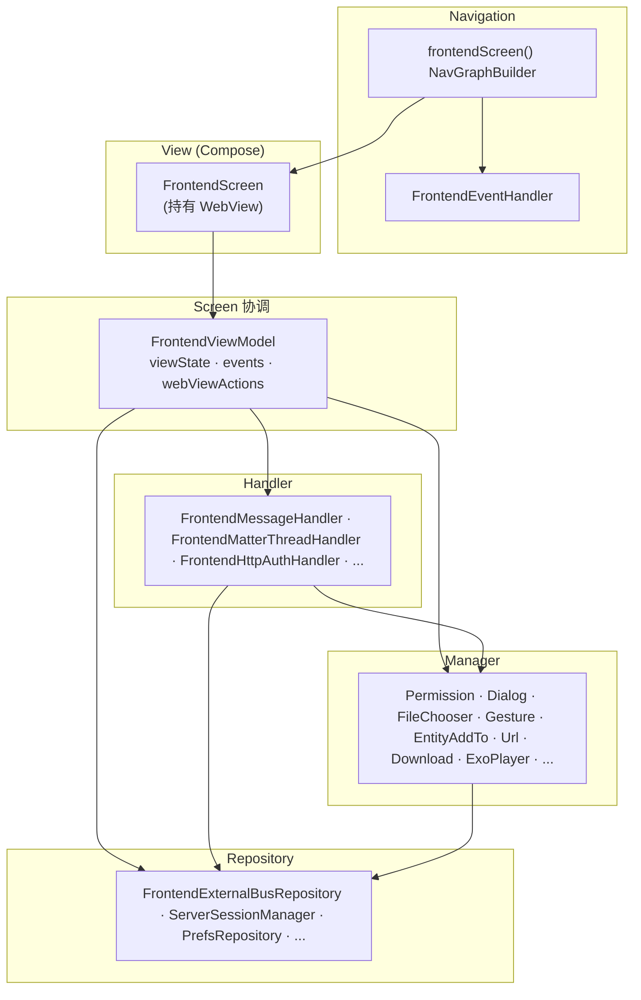
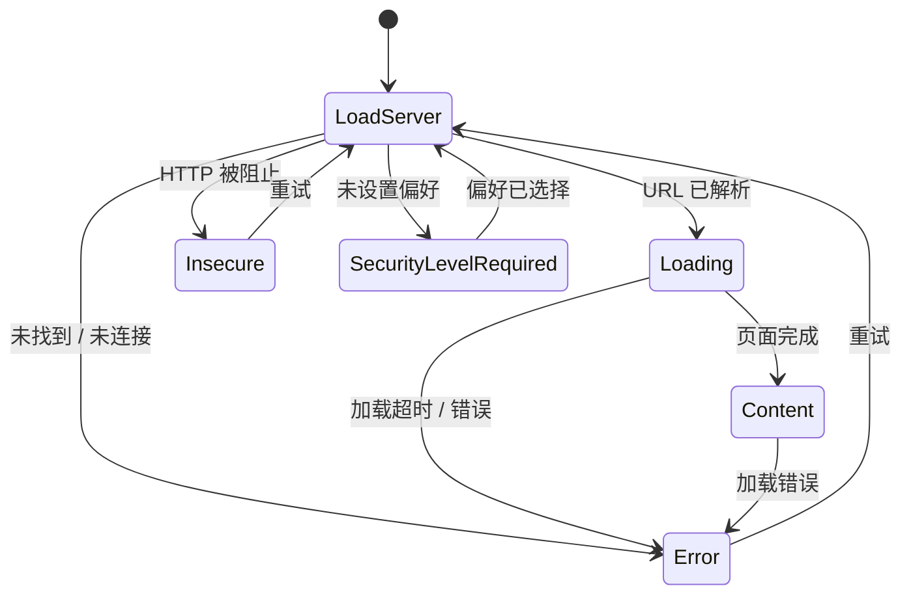
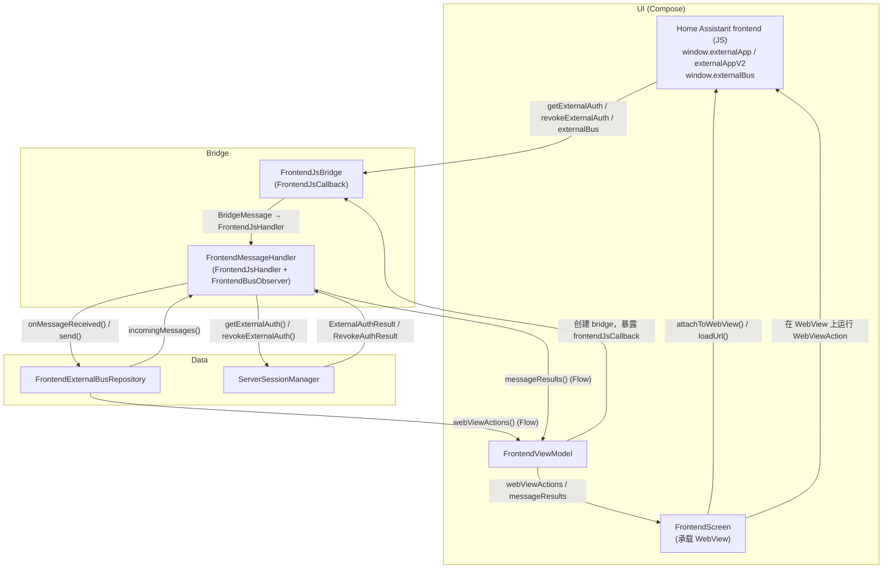

Frontend screen 是 [UI 架构](/developers/android/architecture/ui_architecture.md) 的参考实现，也是应用中最复杂的 screen。它在 [WebView](https://developer.android.com/reference/android/webkit/WebView) 内渲染 Home Assistant frontend，并包装了原生功能（身份验证、手势、下载、NFC、Matter/Thread、媒体播放等）。它的输入（用户、WebView、[external bus](/developers/frontend/external-bus.md)、系统回调、超时）正是该模式所针对的"许多并发源"。代码位于 [`frontend/`](https://github.com/home-assistant/android/tree/main/app/src/main/kotlin/io/homeassistant/companion/android/frontend) 包中。

依赖图遵循该模式的层级。在运行时，结果通过每层暴露的 flow 向上流回：manager 推送 screen 渲染的待处理状态，handler 推送 ViewModel 归约的结果，repository 发射 handler 消费的 typed 消息。



## 概览

| 模式角色 | Frontend 实现 |
|---|---|
| 导航 + 事件消费 | `frontendScreen()`、`FrontendEventHandler` |
| View | `FrontendScreen` / `FrontendScreenContent` |
| ViewModel | `FrontendViewModel` |
| 状态 | `FrontendViewState` |
| 事件 | `FrontendEvent` |
| 动作 | `WebViewAction` |
| 提示 | 带 `FrontendDialog`、`PermissionRequest`、`FileChooserRequest` 的 `SingleSlotQueue` |
| Handler | `FrontendMessageHandler`、`FrontendMatterThreadHandler`、`FrontendHttpAuthHandler` 等 |
| Manager | `PermissionManager`、`FrontendDialogManager`、`FileChooserManager`、`FrontendUrlManager`、`FrontendDownloadManager`、`FrontendExoPlayerManager`、`FrontendGestureManager`、`FrontendEntityAddToManager` 等 |
| Repository | `FrontendExternalBusRepository`、`ServerSessionManager` |

## 状态生命周期与叠加层

`FrontendScreen` 总是在底层渲染 WebView，然后在上面绘制一个叠加层，由当前的 `FrontendViewState` 决定（对 sealed 状态进行 `when`）。WebView 在底层保持挂载状态，因此在叠加层变化时它保留已加载的页面。

| `FrontendViewState` | WebView 之上的叠加层 |
|---|---|
| `LoadServer`、`Loading` | 加载指示器 |
| `Content` | 无，WebView 显示出来 |
| `SecurityLevelRequired` | 安全级别配置 screen |
| `Insecure` | "不安全连接"阻塞 screen |
| `Error` | 连接错误 screen |

ViewModel 将 URL 解析、页面加载回调、超时和用户重试归约为这些状态之间的转换：



`LoadServer` 是入口点（它还会在下一次 URL 解析时清空 WebView）。切换服务器会从任何状态以新的 server id 重新进入 `LoadServer`。一个终止用例：携带 `FrontendConnectionError.UnrecoverableError` 的 `Error`（例如，系统的 WebView 初始化失败）无法重试，ViewModel 会忽略任何进一步离开它的转换。

## 错误处理

连接错误 UI 与 onboarding 共享，因此它不能依赖 `FrontendViewModel`。相反，它依赖一个窄能力接口 `FrontendConnectionErrorStateProvider`，只暴露错误 screen 所需的内容：

```kotlin
interface FrontendConnectionErrorStateProvider {
    val urlFlow: StateFlow<String?>
    val errorFlow: StateFlow<FrontendConnectionError?>
    val connectivityCheckState: StateFlow<ConnectivityCheckState>
    fun runConnectivityChecks()
}
```

`FrontendConnectionErrorScreen` 基于此接口编写，`FrontendViewModel` 实现了它，因此错误叠加层直接将 ViewModel 作为其 provider。`FrontendConnectionErrorStateProvider.noOp` 用于驱动预览和测试。

这是跨 screen 复用 UI 或逻辑而不将其耦合到具体 ViewModel 的通用技巧：为可复用部分所需的精确内容定义一个小接口，并让每个 ViewModel 实现它。依赖关系随后指向接口，而不是某个具体的 ViewModel。

## WebView

`FrontendScreen` 通过可复用的 `HAWebView` composable 挂载 WebView，它在 `AndroidView` 内部创建平台的 `WebView`，应用基线设置，在 nav host 之前将返回按钮路由到 WebView 的历史记录，在预览和截图测试下显示占位符，并报告创建失败（ViewModel 会将其转换为不可恢复的 `Error` 状态）。`FrontendScreen` 然后在上面叠加 frontend 特定配置：它附加了下面两个 client，并连接了 cookie、下载和手势监听器。

两个 client 都由 ViewModel 创建：

* `HAWebViewClient` 由 `HAWebViewClientFactory` 构建。它拥有 TLS 客户端证书身份验证，将加载/SSL 错误映射到 `FrontendConnectionError`，报告页面完成、暴露 HTTP Basic-auth 挑战，并从渲染进程崩溃中恢复。
* `HAWebChromeClient` 由 `viewModel.createWebChromeClient(...)` 构建。它处理运行时权限请求（摄像头/麦克风）、JavaScript `confirm()` 对话框、文件选择器和全屏 custom-view 移交。

:::note 故意的例外
ViewModel 通常不引用任何平台 UI 类型。WebView client 是被接受的唯一例外：它们必须与 ViewModel 逻辑（错误映射、页面加载回调、HTTP auth、权限）连接，因此 ViewModel 构建并拥有它们。这不损害单元测试能力：client 来自一个测试可以伪造的工厂，而 chrome client 只有在 screen 请求时才构建，因此 ViewModel 的归约逻辑仍然可以作为纯 JVM 单元测试运行。
:::

## Frontend ↔ 原生通信

Frontend（JavaScript）和原生代码通过 JavaScript bridge 进行通信。这就是驱动 [external authentication](/developers/frontend/external-authentication.md) 和 [external bus](/developers/frontend/external-bus.md) 消息传递的基础。`FrontendScreen` 是唯一持有 WebView 的地方；它下面的所有代码都保持 UI 无关，并通过 `Flow` 通信。



`FrontendJsBridge` 是注册到 WebView 的 JavaScript 接口。它接收来自 frontend 的原始调用，将其解析为类型化的 `BridgeMessage` 变体，并将其分派给 `FrontendMessageHandler`。`FrontendExternalBusRepository` 拥有类型化的、双向的 bus 通道：传入的 JSON 被反序列化为 `IncomingExternalBusMessage`（以向前兼容的方式处理未知类型），而传出的 `OutgoingExternalBusMessage` 被序列化为排队的 `WebViewAction.EvaluateScript`。

消息流程通过 `Flow` 与 WebView 解耦。ViewModel 和下层从不直接调用 WebView API；它们发射只有 `FrontendScreen` 运行的 `WebViewAction`：

* 入站（frontend → 原生）：frontend 调用 bridge（`externalBus`）→ `FrontendJsBridge` 解析 `BridgeMessage` 并分派它 → `FrontendMessageHandler` 将其交给 `FrontendExternalBusRepository.onMessageReceived()` → repository 反序列化并在 `incomingMessages()` 上发射 → handler 通过 `messageResults()` 将其映射为 `FrontendHandlerEvent` → ViewModel 将其归约为状态、事件或动作。
* 出站（原生 → frontend）：组件使用类型化的 `OutgoingExternalBusMessage` 调用 `FrontendExternalBusRepository.send()` → 它被序列化为包裹在 `WebViewAction.EvaluateScript` 中的 `externalBus(...)` 脚本 → 通过 `webViewActions()` 暴露 → `FrontendScreen` 在 WebView 中执行它，调用 `window.externalBus`。
* 身份验证（单独的通道）：frontend 调用 `getExternalAuth`/`revokeExternalAuth` → handler 询问 `ServerSessionManager` → 生成的回调脚本在 WebView 中执行，调用已验证的 frontend 回调（`externalAuthSetToken`/`externalAuthRevokeToken`）。

动作和事件 flow 是缓冲的 `SharedFlow`，因此在 WebView 暂时不可用时不会丢弃命令。

`FrontendJsBridge` 根据服务器版本注册两个协议之一：

* V1（`window.externalApp`）：通过 [`WebView.addJavascriptInterface`](https://developer.android.com/reference/android/webkit/WebView#addJavascriptInterface\(java.lang.Object,%20java.lang.String\)) 的遗留协议；frontend 直接调用命名方法。
* V2（`window.externalAppV2`）：在 Home Assistant 2026.4.2 中通过 [`WebViewCompat.addWebMessageListener`](https://developer.android.com/reference/androidx/webkit/WebViewCompat) 引入；所有消息都作为带有 `type` 判别器的 JSON envelope 通过 `postMessage` 传递，带有 origin 和 iframe 过滤以实现安全性。

当服务器支持 V2 且设备的 WebView 支持 [`WEB_MESSAGE_LISTENER`](https://developer.android.com/reference/androidx/webkit/WebViewFeature#WEB_MESSAGE_LISTENER) 特性时，应用选择 V2；否则回退到 V1。

## 依赖注入与作用域

Per-session 的 block 是 `@ViewModelScoped`，因此每个 `FrontendViewModel` 获得新的实例，而一个 screen 会话内的每个消费者共享它们。这包括 `FrontendExternalBusRepository`：bus 只对一个 screen 的 WebView 存在，因此将其作用域设置为会话可防止一个访问的缓冲消息泄漏到下一个。`FrontendHandlerModule` 在 `ViewModelComponent` 中将 `FrontendMessageHandler` 绑定到 `FrontendJsHandler` 和 `FrontendBusObserver`。

## 测试 Frontend screen

| 层 | 测试类型 | 关注点 |
|---|---|---|
| `FrontendViewModel` | 单元（JUnit5 + Turbine） | 归约逻辑：哪个输入产生哪个状态 / 事件 / 动作。 |
| Manager 和 handler | 单元 | 每个关注点隔离；断言返回的 sealed 结果或发射的待处理状态。 |
| `FrontendScreenContent` | Compose UI | 每种状态下的渲染，以及交互是否调用了正确的回调。 |
| `FrontendEventHandler` | Compose UI | 发射每个 `FrontendEvent` 时是否调用了正确的 host 回调（导航、snackbar 等）。 |
| `FrontendScreen` | 截图 | 仅视觉回归（无逻辑）。 |
