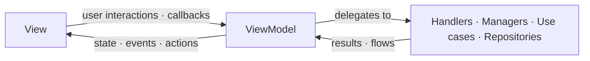
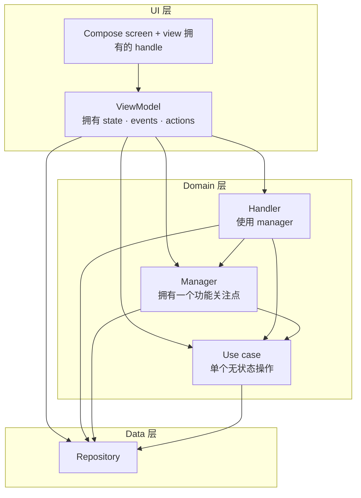

本页描述了 screen 在应用中是如何构建的。它是 [Google 推荐的应用架构](https://developer.android.com/topic/architecture) 的一种类似 MVI 的诠释：同样的 UI、domain 和 data 层，但对 screen 的输入和输出如何流动定义了更严格的契约。新的 UI 应遵循它，现有的 screen 随时间逐步迁移到它。[Frontend screen](/developers/android/architecture/frontend_screen.md) 是参考实现。

## 该模式

一个 screen 通常有很多并发的输入源：用户、系统回调（权限、文件选择器）、计时器以及外部通道。该模式将它们全部归约为少数几个定义良好的输出，使 screen 保持可预测且可测试。

它也是保持 screen 可维护性的关键。应用拥有许多功能，单个 screen 可能会引入大量功能。如果没有结构，会导致 screen 类或 ViewModel 知道一切，且无法安全地进行测试或更改。相反，每个关注点都存在于自己独立的、职责单一的小 block 中（参见[构建模块](#building-blocks)），因此随着 screen 的增长，它仍然易于处理。

### 单向数据流

输入（用户交互、回调、外部消息、系统结果）向下进入 ViewModel，ViewModel 将工作委托给下面的各个 block，并将它们的结果归约为向上传输回各 channel：

* 单一状态：要渲染什么；
* 一次性事件：导航和其他 fire-and-forget 副作用；
* 动作：针对由 view 拥有的对象的命令式操作。

给定的输入只产生它需要的输出，通常只是一个新状态，有时一个都没有。动作仅存在于 view 拥有命令式对象（如 `WebView`）的 screen 中；大多数 screen 不需要它们（参见[动作](#actions)）。



### 构建模块

每个 block 都有单一职责和与邻居通信的明确方式。

#### View 视图

Compose screen。它根据当前状态进行渲染，持有下层绝不能触碰的任何 UI handle（如 `WebView`、列表的滚动状态等），运行针对这些 handle 排队的[动作](#actions)，观察 manager 暴露的待处理状态，并通过回调将用户交互报告回 ViewModel。

将其拆分为有状态的入口点和无状态的内容 composable，以便预览和 Compose 测试可以直接驱动它：

```kotlin
@Composable
internal fun SettingsScreen(viewModel: SettingsViewModel) {
    val viewState by viewModel.viewState.collectAsStateWithLifecycle()

    SettingsScreenContent(
        viewState = viewState,
        onNameChange = viewModel::onNameChange,
    )
}

@Composable
internal fun SettingsScreenContent(viewState: SettingsViewState, onNameChange: (String) -> Unit) {
    // 无状态：渲染 viewState 并通过回调报告交互。
}
```

#### ViewModel 视图模型

ViewModel 拥有 screen 的输出 channel，并将下面的各个 block 连接在一起：它将每个输入归约为一个新状态、一个一次性事件或一个排队的动作。典型的形态：

```kotlin
val viewState: StateFlow<UiState> // 要渲染什么
val events: SharedFlow<UiEvent>   // 一次性副作用
val actions: Flow<UiAction>       // 仅在 view 拥有命令式 handle 时
```

重新发射相同状态必须是空操作（no-op）：归约可能产生一个与当前值相等的值，这绝不能触发工作或渲染。`StateFlow` 通过跳过等于当前值的发射来保证这一点，这也是状态类必须实现结构相等的原因（data class 即可）。

它从不引用 Compose 或平台 UI 类型，因此其逻辑可以作为纯 JVM 单元测试运行。它还会比配置变更更长寿：只有当 screen 永久消失时，`viewModelScope` 才会被取消，因此旋转不会取消并重新启动加载或 flow 收集等长时间运行的工作。

保持其瘦小。小 screen 的 ViewModel 可以直接持有其功能逻辑。随着 screen 的增长，将内聚的逻辑提取到[下面的 block](#blocks) 中，而不是让 ViewModel 混合无关的关注点。它自身的工作是协调：拥有 channel 并路由输入，而不是每个功能的内部实现。

##### 状态

用于描述渲染什么内容的单一真实来源。ViewModel 将其保存在 `StateFlow` 中。

状态类必须是不可变的：使用 `val` 属性和不可变集合，并为每次更改生成一个新实例（通过 `copy()`）。就地突变会破坏 Compose 的变更检测和单向流。

状态还必须易于读取。Compose 在重组期间在主线程上读取它，因此不要暴露一个计算任何内容的 `get()`（排序、过滤、格式化）：它会在每次重组时再次运行。请在创建状态时预先计算这样的值，可以在 ViewModel 或它下面的 block 中完成，这样工作可以在后台 dispatcher 上运行：

```kotlin
// 错误：在主线程上、每次重组时构建下拉项
data class UiState(val servers: List<Server>) {
    val serverItems: List<HADropdownItem<Int>>
        get() = servers.map { HADropdownItem(key = it.id, label = it.friendlyName) }
}

// 正确：在创建状态时映射一次
data class UiState(val serverItems: List<HADropdownItem<Int>>)
```

按照 screen 的形状来设计：

* 当 screen 始终具有相同的形状且只有其字段发生变化时，使用一个 data class；
* 当 screen 具有真正不同的模式时使用 sealed 层级，例如：

```kotlin
sealed interface UiState {
    data object Loading : UiState
    data class Content(val items: List<Item>) : UiState
    data class Error(val error: ErrorReason) : UiState
}
```

对于 sealed 层级，编译器强制要求穷尽处理，而且一种模式的字段不会泄漏到另一种模式中，这与扁平模型不同，扁平模型的 nullable 字段和布尔值可以表达不可能的组合。

##### 事件

一次性、fire-and-forget 的效果：导航、显示 snackbar、打开链接。将它们建模为 sealed interface（当变体共享字段时也可以是 sealed class），这样效果的集合就是封闭的，事件处理程序的 `when` 就是穷尽的；编译器会标记任何未处理的事件：

```kotlin
sealed interface UiEvent {
    data object NavigateBack : UiEvent
    data class ShowSnackbar(@StringRes val messageResId: Int) : UiEvent
    data class OpenExternalLink(val uri: Uri) : UiEvent
}
```

在 `Flow` 上发射它们，并精确地消费每个事件一次，通常在导航层，该层持有导航控制器和 host 回调。事件绝不能被持久化或重放：在重组时重放一个 "navigate" 会导致导航两次。如果 UI 必须在配置变更后再次显示它，那么它就是状态，而不是事件。

##### 动作

某些命令式对象必须存在于 view 中，因为 UI 框架在组合内部创建了它们：一个 `WebView`、一个 `LazyListState`、一个 focus requester。ViewModel 绝不能持有对其中一个的引用，那会使其与平台 UI 类型绑定并破坏其单元测试能力。然而，对它们的一些操作确实是命令式的（"立即重新加载"、"滚动到顶部"、"执行此脚本"），无法表示为声明式状态。

动作队列解决了这种张力：ViewModel 将类型化的动作发射到一个 `Flow` 上，view 收集它并在自己拥有的 handle 上运行它。与事件一样，将动作建模为 sealed interface，使命令的集合是封闭的，每个变体都携带自己针对该 handle 的 `run`：

```kotlin
sealed interface WebViewAction {
    fun run(webView: WebView)

    data object Reload : WebViewAction {
        override fun run(webView: WebView) = webView.reload()
    }

    data class EvaluateScript(val script: String) : WebViewAction {
        override fun run(webView: WebView) {
            webView.evaluateJavascript(script, null)
        }
    }
}

// 在 view 中，唯一持有 WebView 的地方：
LaunchedEffect(webView) {
    webViewActions.collect { action -> action.run(webView) }
}
```

可等待的变体携带一个 `CompletableDeferred`，以便调用者可以等待结果，例如脚本的返回值。

该 flow 是一个一次性消费的 `SharedFlow`，经过缓冲，以便在 view 暂时不可用时不会丢弃命令。它被刻意地不作状态处理：作为状态持有的命令会在每次重组时重新运行。它也不是事件：事件是 host 做出反应的信号（导航、snackbar），而动作驱动该 screen 拥有的特定对象。

将动作保留给必须存在于 view 中的对象。下层可以拥有的任何东西都应在那里拥有：例如，媒体播放器由 manager 持有，并通过状态暴露，不涉及动作队列。在实践中，一个 screen 最多拥有一个这样的 handle，通常一个都没有。

#### Block 构建块

ViewModel 将功能逻辑委托给四种 block。它们共同构成了 screen 的 domain 和 data 层。

##### Handler 处理器

Handler 是从 ViewModel 中提取出来的、使用一个或多个 manager 的逻辑。协调就发生在这里：ViewModel 应保持瘦小，而 manager 绝不能依赖另一个 manager。Handler 可以是一次性的翻译器（将一个输入映射到类型化的结果），也可以是跨异步往返驱动几个 manager 的多步骤流程；它可以是无状态的，或者持有瞬时的 flow 状态。这些都不是定义它的要素：依赖 manager 才是。

它将自己的工作作为 sealed 结果（拉取）或结果流（推送）交回给 ViewModel。它可以保持自己 feature 范围内的状态，ViewModel 将其映射到 screen 状态中。screen 的单一状态始终属于 ViewModel，而非 handler。

##### Manager 管理器

Manager 拥有恰好一个功能关注点的逻辑和内存状态。它只依赖于 repository、use case 和平台 API，绝不依赖于另一个 manager。如果它需要一个，那么这种协调是[handler](#handlers) 的工作。它以一种或多种以下方式与 ViewModel 和 view 通信：

* 推送待处理状态：暴露一个 `StateFlow<T?>`，view 观察并渲染它；
* 拉取结果：一个 `suspend` 函数，返回 ViewModel 处理的 sealed 结果；
* 拉取流：一个 `Flow` 结果流，ViewModel 收集它。

Manager 也是用户提示存在的地方：必须显示 UI 并等待用户答案的交互，例如对话框、权限请求或文件选择器。对于这些，请使用 `SingleSlotQueue`，当一次只能有一个提示在屏幕上时它会进行序列化。队列本身是当前请求的 `StateFlow<T?>`（它通过委托实现该接口），因此 manager 将其作为待处理状态暴露给 view 渲染，而 `awaitResult { onResult -> ... }` 会挂起调用者，直到 UI 调用 `onResult`，然后释放该 slot 给下一个请求。提示不是第四个输出 channel：它将渲染的待处理状态与作为常规输入到达的答案组合起来，而 `awaitResult` 将该往返折叠为一个挂起调用。

##### Use case 用例

Use case 是单个可复用的操作，无状态，以其执行的动作命名，并暴露为简单的方法或 `operator fun invoke(...)`：

```kotlin
class CheckLocalNetworkPermissionUseCase @Inject constructor(
    private val serverManager: ServerManager,
    ...
) {
    suspend operator fun invoke() { ... }
}
```

当某段逻辑被多于一个调用者需要，或者会让 ViewModel 或 manager 变得臃肿，但它自身没有状态时，就选择它。Use case 可以依赖 repository，但绝不能依赖 manager 或 handler。代码库中的示例：`CheckLocalNetworkPermissionUseCase`、`ServerChooserItemsUseCase`。

##### Repository 仓库

Repository 是某个数据源或通信通道的单一真实来源，抽象化数据所在的位置（存储、网络、外部通道）。它没有 UI 关注点。数据库访问也通过 repository 进行，repository 通过其 DAO 与 [Room](https://developer.android.com/training/data-storage/room) 数据库通信：DAO 是数据源，repository 是应用的其余部分看到的抽象。

Repository 不应依赖另一个 repository：合并多个数据源是逻辑，而逻辑存在于 use case、manager 或 handler 中。

### 层与依赖规则

这些 block 映射到 [Google 推荐架构](https://developer.android.com/topic/architecture) 的层：view 和 ViewModel 是 UI 层，handler、manager 和 use case 构成 domain 层，repository 是 data 层。依赖只能向下指向，因此图在结构上就是无环的：



每一条边都向下指向。在运行时，数据通过每一层暴露的 flow 以状态、事件和动作的形式向上流回。

* 一条规则决定层级。Manager 只依赖 repository、use case 和平台 API；handler 是任何依赖 manager 的东西。一个需要另一个 manager 的 manager，按此定义就是一个 handler，因此 `manager → manager` 不可能发生。
* 只能向下。没有 `handler → handler`（在 ViewModel 中协调 handler），没有 `repository → repository`（在 use case、manager 或 handler 中合并数据源），也没有向上的边（use case 或 manager 绝不依赖 handler）。
* ViewModel 可以直接访问任何层。当逻辑较小时，它直接使用 manager、use case 或 repository；只有当跨 manager 的协调会使其变得臃肿时，它才提取 handler（参见 [ViewModel](#viewmodel)）。

这使得每个 block 都能独立测试，并防止隐藏的循环。

#### 作用域

根据状态必须存活的时间长短为每个 block 设置作用域。与一个 screen 绑定的 block 是 `@ViewModelScoped`：每个 screen 会话一个共享实例，因此注入它的所有代码都看到相同的状态，而且该状态在会话结束时重置。代表应用级关注点的 repository 或 manager 通常是 `@Singleton`。

共享实例部分对于任何被多处依赖的有状态 block 都很重要。如果 ViewModel 和 handler 都注入了它，它们必须获得相同的对象，否则它们对状态的视图会分叉；无作用域的绑定会给每个消费者一个独立的副本。

:::note
通过 Hilt 提供所有东西。永远不要手动实例化这些 block。
:::

### 选择输出

询问输出是什么，而不是它在哪里产生：

| 如果输出... | 使用 | 原因 |
|---|---|---|
| 决定了要渲染什么内容，并且必须在重组/旋转后存活 | [状态](#state) | 持久的 UI；重新发射相同值必须是空操作 |
| 是一次性副作用，必须恰好触发一次且不能被重放 | [事件](#events) | 重放它（例如在重组时）会导致双重导航或双重 toast |
| 是针对 view 拥有 handle 的命令式操作 | [动作](#actions) | ViewModel 保持 UI 无关；只有 view 持有该 handle |
| 需要提示用户并等待串行化的响应 | [提示](#managers) | 一次一个提示；调用者挂起直到用户回答 |

### 选择构建模块

自上而下地进行；第一行匹配即胜：

| 你拥有的是什么 | 选择 | 决定性问题 |
|---|---|---|
| 对数据源或通信通道的访问 | [Repository](#repositories) | "某些数据/IO 的单一真实来源？" |
| 单个可复用操作，自身无状态 | [Use case](#use-cases) | "一个无状态操作？" |
| 一个功能的关注点，带有自己的内存状态 | [Manager](#managers) | "它是否只依赖 repository 和 use case？" |
| 协调一个或多个 manager 的逻辑 | [Handler](#handlers) | "它是否依赖 manager？" |
| 组合功能并拥有屏幕上显示的内容 | [ViewModel](#viewmodel) | "screen 级状态或协调？" |

Handler vs manager 归结为一个问题：它是否依赖 manager？不要去找 "无状态 vs 有状态" 或 "翻译 vs 协调"，handler 可以是其中任何一种。依赖关系就是全部测试，也是使 `manager → manager` 从结构上不可能的原因。

有状态性影响的是作用域：有状态的 block 必须设置作用域，使其状态具有正确的生命周期，并使每个消费者共享一个实例（参见 [作用域](#scoping)）。

命名遵循 block：`*Repository`、`*UseCase`、`*Manager`、`*Handler`。

### 测试

这种分离使 screen 变得可测试：

| 层 | 测试类型 | 关注点 |
|---|---|---|
| ViewModel | 单元 | 归约逻辑：哪个输入产生哪个状态 / 事件 / 动作。 |
| Handler、manager、use case | 单元 | 每个关注点隔离；断言返回的 sealed 结果或发射的待处理状态。 |
| 无状态的 screen 内容 | Compose UI | 每种状态下的渲染，以及交互是否调用了正确的回调。 |
| 事件处理程序 | Compose UI | 每个事件在发射时是否触发了正确的导航 / 副作用。 |
| Screen | 截图 | 仅视觉回归（无逻辑）。 |

ViewModel 及其下面的每个 block 都不包含 Compose 和平台 UI 类型，这就是它们可以作为普通 JVM 单元测试运行的原因。关于项目的约定，请参阅[测试概述](/developers/android/testing/introduction.md)、[单元测试](/developers/android/testing/unit_testing.md)和[截图测试](/developers/android/testing/screenshot_testing.md)。
