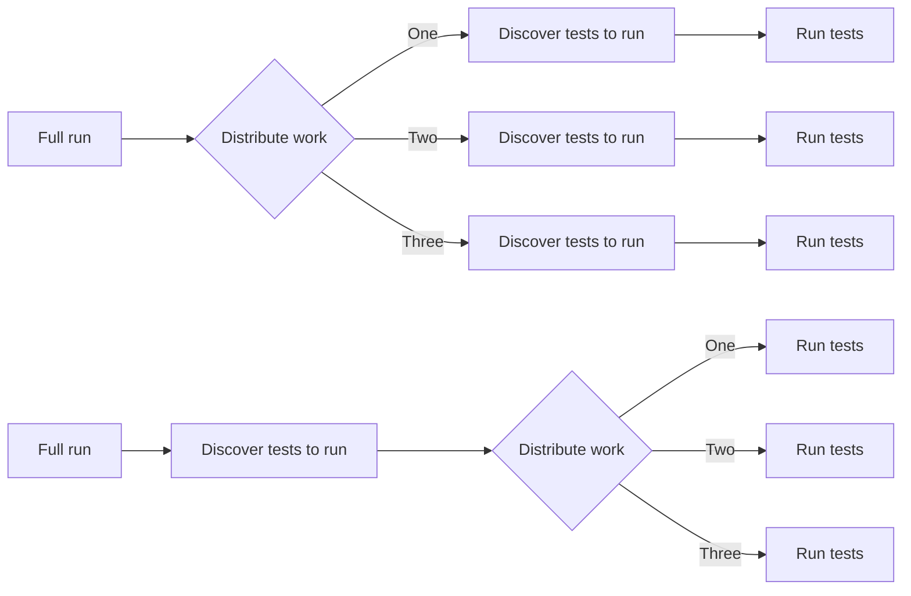

在 [UV 每月为我们找回 215 个计算小时](/developers/blog/2024-04-03-build-images-with-uv.md) 之后，我们对速度有了更高的追求。
我们的 CI workflow 在每次 commit 时触发，由于贡献量巨大，它在 2024 年 3 月被触发了 6647 次。
完整的运行（即执行整个测试套件）耗时很长。

结果发现，我们用来将测试分成 10 个组的插件效率很低。每个 pytest job 都需要发现所有测试，即使该 job 打算只执行其中一部分。

现在我们有一个单独的 job 来发现所有测试并将它们分成 10 个组。10 个 pytest job 只需要执行所有测试的一个子集。不在每个 test runner 中进行完整的发现，每次完整运行可节省我们 3 小时！

对 2024 年 3 月的 6647 个 CI workflow 的简要分析揭示了以下统计：

* 2406 个在终止前被取消
  * 1771 个应为 full runs
* 1085 个失败
  * 732 个为失败的 full runs
* 3007 个成功终止
  * 1629 个 partial runs（仅执行了给定集成的测试）
  * 1378 个 full runs

考虑到 1378 个成功的 full runs，如果有了 [#114381](https://github.com/home-assistant/core/pull/114381)，我们在 2024 年 3 月将节省约 **4042 小时 ~ 168 天** 的执行时间。如果我还分析了失败/取消的 runs，节省的时间会更多。

每月节省的超过 168 天的执行时间可供其他任务使用，使所有开发者和我们社区的 CI 体验更好。
我们通过使用更少的资源来运行测试套件，提高了可持续性。

**非常感谢 GitHub 为 Home Assistant 提供额外的 CI runner。**
