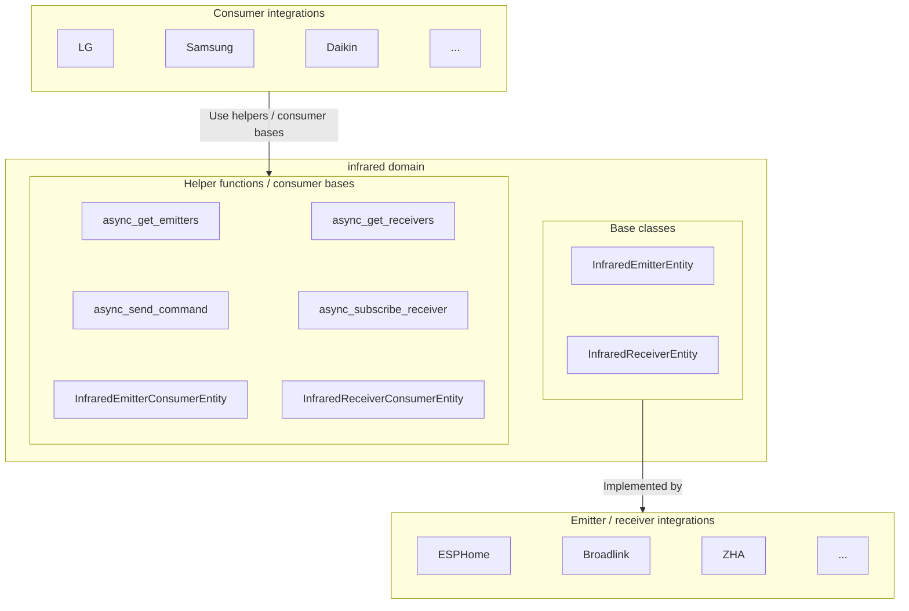

Infrared 域提供了 IR 硬件（如 ESPHome、Broadlink 或 ZHA 设备）与需要发送或接收 IR 命令的设备特定集成（如 LG 或 Samsung 电视控制）之间的抽象层。它定义了两类虚拟实体——一个发送 IR 命令的**发射器**（emitter）和一个捕获传入 IR 信号的**接收器**（receiver），其他集成可以使用它们来控制或对 IR 设备做出反应。

发射器和接收器基类位于 [`homeassistant.components.infrared`](https://github.com/home-assistant/core/blob/dev/homeassistant/components/infrared/entity.py)。

## 架构概览

Infrared 集成在以下方面创建分离：

1. **Emitter 集成**（如 ESPHome、Broadlink）：这些实现 `InfraredEmitterEntity`，以提供硬件特定的 IR 传输。
2. **Receiver 集成**（如 ESPHome、Broadlink）：这些实现 `InfraredReceiverEntity`，以提供硬件特定的 IR 接收。
3. **Consumer 集成**（如 LG、Samsung）：这些使用 infrared 辅助函数——或提供的 consumer 基类——通过发射器发送设备特定的 IR 命令和/或对来自接收器的信号做出反应。



## 设备类型

Infrared 实体公开一个 [`InfraredDeviceClass`](https://github.com/home-assistant/core/blob/dev/homeassistant/components/infrared/entity.py)，反映其角色：

| 值      | 含义                                              |
| ---------- | ---------------------------------------------------- |
| `emitter`  | 发送 IR 命令。由 `InfraredEmitterEntity` 自动设置。 |
| `receiver` | 接收 IR 信号。由 `InfraredReceiverEntity` 自动设置。 |

Emitter 和 receiver 集成无需自行设置 device class——基类会自动分配。

## InfraredEmitterEntity

Emitter 实体封装了一个 IR 发射器硬件。基类是 `InfraredEmitterEntity`，由 `InfraredEmitterEntityDescription` 描述。

### 状态

Infrared emitter 实体状态表示最后发送 IR 命令的时间戳。这在基类 InfraredEmitterEntity 中实现，集成不应更改。

### 发送命令方法

`InfraredEmitterEntity.async_send_command` 方法必须由 emitter 集成实现，以处理实际的 IR 传输。

```python
class MyInfraredEmitter(InfraredEmitterEntity):
    """My infrared emitter."""

    async def async_send_command(self, command: infrared_protocols.commands.Command) -> None:
        """Send an IR command.

        Args:
            command: The IR command to send.

        Raises:
            HomeAssistantError: If transmission fails.
        """
```

:::important
Consumer 集成不得直接调用 `InfraredEmitterEntity.async_send_command`。请使用 [`async_send_command`](#send-command) 辅助函数（或 [`InfraredEmitterConsumerEntity`](#emitter-consumer-base-class) 基类），它会自动处理状态更新和 context 传播。
:::

## InfraredReceiverEntity

Receiver 实体封装了一个 IR 接收器硬件。基类是 `InfraredReceiverEntity`，由 `InfraredReceiverEntityDescription` 描述。

### 状态

Infrared receiver 实体状态表示最后接收 IR 信号的时间戳。这在基类 InfraredReceiverEntity 中实现，集成不应更改。

### 报告接收到的信号

Receiver 集成在硬件上观察到 IR 信号时，从基类调用 `_handle_received_signal`。基类更新状态并通知订阅者。

```python
class MyInfraredReceiver(InfraredReceiverEntity):
    """My infrared receiver."""

    def _on_hardware_signal(self, timings: list[int], modulation: int | None) -> None:
        self._handle_received_signal(
            InfraredReceivedSignal(timings=timings, modulation=modulation)
        )
```

## 辅助函数

Infrared 域公开了辅助函数，使 consumer 集成能够发现硬件并与之交互，而无需持有对实体实例的直接引用。

### 获取 emitters

返回所有可用的 infrared emitter 实体的实体 IDs。

```python
from homeassistant.components import infrared

emitters = infrared.async_get_emitters(hass)
```

### 获取 receivers

返回所有可用的 infrared receiver 实体的实体 IDs。

```python
from homeassistant.components import infrared

receivers = infrared.async_get_receivers(hass)
```

### 发送命令

通过特定的 emitter 实体发送 IR 命令。

```python
from infrared_protocols.commands.nec import NECCommand
from homeassistant.components import infrared

command = NECCommand(
    address=0x04,
    command=0x08,
    modulation=38000,  # 38 kHz carrier frequency
)

await infrared.async_send_command(
    hass,
    emitter_entity_id,
    command,
    context=context,  # 用于 logbook 跟踪的可选 context
)
```

### 订阅接收器

订阅来自特定 receiver 实体的 IR 信号。返回一个取消订阅的回调。

```python
from homeassistant.components import infrared
from homeassistant.components.infrared import InfraredReceivedSignal

@callback
def handle_signal(signal: InfraredReceivedSignal) -> None:
    ...

unsubscribe = infrared.async_subscribe_receiver(
    hass, receiver_entity_id, handle_signal
)
```

## Consumer 基类

Consumer 集成通常不需要直接调用发送/接收辅助函数。Infrared 集成提供了两个基类，负责跟踪底层硬件的可用性，以及（对于 receivers）管理订阅生命周期。

### Emitter consumer 基类

`InfraredEmitterConsumerEntity` 跟踪所配置 emitter 的可用性，并暴露一个 `_send_command` 方法，通过 `async_send_command` 转发，包括实体的当前 context。

```python
from homeassistant.components.infrared import InfraredEmitterConsumerEntity

class MyButton(InfraredEmitterConsumerEntity, ButtonEntity):
    """A button that emits an IR command."""

    def __init__(self, emitter_entity_id: str) -> None:
        self._infrared_emitter_entity_id = emitter_entity_id

    async def async_press(self) -> None:
        await self._send_command(SOME_COMMAND)
```

基类根据 emitter 的状态设置 `self._attr_available`，并在 emitter 变为可用或不可用时进行更新。

### Receiver consumer 基类

`InfraredReceiverConsumerEntity` 跟踪所配置 receiver 的可用性，在可用时订阅其信号，并在 receiver 消失时自动取消订阅。子类实现 `_handle_signal`。

```python
from homeassistant.components.infrared import (
    InfraredReceivedSignal,
    InfraredReceiverConsumerEntity,
)

class MyRemote(InfraredReceiverConsumerEntity, EventEntity):
    """An event entity that fires when an IR signal is received."""

    def __init__(self, receiver_entity_id: str) -> None:
        self._infrared_receiver_entity_id = receiver_entity_id

    @override
    @callback
    def _handle_signal(self, signal: InfraredReceivedSignal) -> None:
        ...
```

## IR 命令

[`infrared-protocols`](https://github.com/home-assistant-libs/infrared-protocols) 库提供了命令类，将协议特定的数据（NEC、RC-5、Kaseikyo 等）转换为原始 timings。

所有 IR 命令继承自 `infrared_protocols.commands.Command` 并实现 `get_raw_timings()`。
