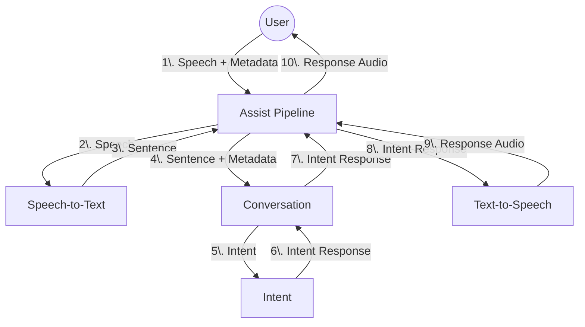

构建一个语音助手是一项复杂的任务。它需要许多不同的技术协同工作。本页将概述 Home Assistant 内部的不同组件以及它们将如何协同工作。

* **Assist Pipeline** 集成负责将用户的语音转换为文本，对其进行处理，并将响应转换为语音。
* **Conversation** 集成负责处理用户的文本。内置的 conversation agent 通过将其匹配到 intent 来完成此操作。集成可以提供[自定义 conversation agent](/developers/core/entity/conversation.md)。
* **Intent** 集成负责执行 intent 并返回响应。
* **Text-to-Speech** 集成负责将文本转换为语音。集成可以提供[自定义 text-to-speech agent](/developers/core/entity/tts.md)。
* **Speech-to-Text** 集成负责将语音转换为文本。集成可以提供[自定义 speech-to-text agent](/developers/core/entity/stt.md)。

## 捕获用户的语音

上述图表没有描述的内容是如何捕获用户的语音。实现方式会有很多种。

最终目标是打造**Voice Satellites（语音卫星设备）**。这些设备可以放置在房屋的任何位置。一旦检测到唤醒词，它就会捕获用户的语音，将其发送到 Home Assistant，并向用户播放响应。
