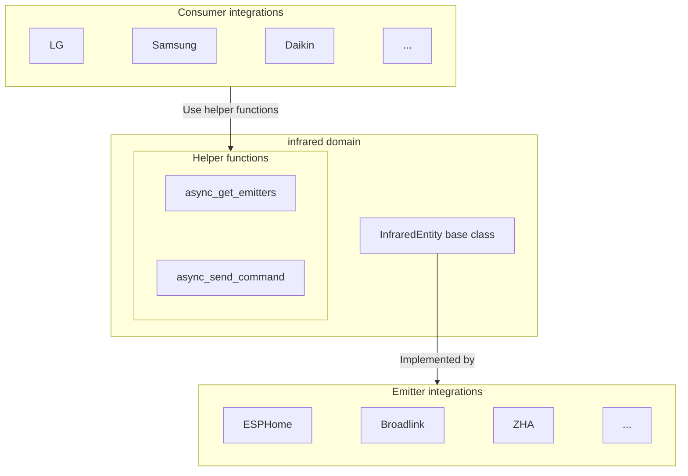

# 红外实体

红外实体在红外发射器硬件（如 ESPHome、Broadlink 或 ZHA 设备）与需要发送红外命令的设备集成（如 LG 或三星电视控制）之间提供抽象层。它充当虚拟红外发射器，供其他集成用来控制红外设备。

红外实体源自[`homeassistant.components.infrared.InfraredEntity`](https://github.com/home-assistant/core/blob/dev/homeassistant/components/infrared/__init__.py)。

## 架构概述

红外实体集成在以下方面创建了分离：

1. **发射器集成**（如 ESPHome、Broadlink）：它们实现 `InfraredEntity` 以提供特定于硬件的 IR 传输功能。
2. **消费者集成**（如 LG、Samsung）：它们使用红外辅助函数，通过可用的发射器发送设备特定的 IR 命令。



## 红外实体类

### 状态

红外实体状态表示最后一个红外命令发送时的时间戳。这是在 InfraredEntity 基类中实现的，不应通过集成进行更改。

### 发送命令方式

`InfraredEntity.async_send_command` 方法必须通过发射器集成来实现，以处理实际的红外传输。

```python
class MyInfraredEntity(InfraredEntity):
    """My infrared entity."""

    async def async_send_command(self, command: infrared_protocols.Command) -> None:
        """Send an IR command.

        Args:
            command: The IR command to send.

        Raises:
            HomeAssistantError: If transmission fails.
        """
```

:::important
消费者集成不应直接调用 `InfraredEntity.async_send_command`。请改用 [`infrared.async_send_command`](#send-command) 辅助函数，它会自动处理状态更新和上下文管理。
:::

## 辅助函数

红外域为消费者集成提供辅助功能，以发现发射器并发送红外命令。

### 获取发射器

返回所有可用红外发射器实体的列表。

```python
from homeassistant.components import infrared

emitters = infrared.async_get_emitters(hass)
```

### 发送命令

向特定的红外实体发送红外命令。

```python
from infrared_protocols import NECCommand
from homeassistant.components import infrared

command = NECCommand(
    address=0x04,
    command=0x08,
    modulation=38000,  # 38 kHz carrier frequency
)

await infrared.async_send_command(
    hass,
    ir_entity_id,
    command,
    context=context,  # Optional context for logbook tracking
)
```

## 红外命令

[红外协议库](https://github.com/home-assistant-libs/infrared-protocols) 为 IR 命令提供基类，将特定于协议的数据转换为原始时序。

所有IR命令必须继承自`infrared_protocols.Command`并实现`get_raw_timings()`方法。
