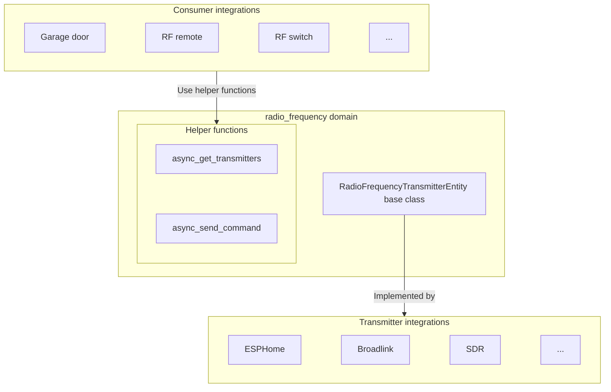

Radio frequency 实体在 RF 收发器硬件（如 ESPHome、Broadlink 或基于 SDR 的设备）与需要发送 RF 命令的设备特定集成（如车库门开启器、RF 遥控器或无线开关）之间提供了一个抽象层。它充当一个虚拟 RF 发射器，可被其他集成用于控制 RF 设备。

Radio frequency 发射器实体派生自 [`homeassistant.components.radio_frequency.RadioFrequencyTransmitterEntity`](https://github.com/home-assistant/core/blob/dev/homeassistant/components/radio_frequency/__init__.py)。

## 架构概览

Radio frequency 实体集成在以下方面创建分离：

1. **Transmitter 集成**（如 ESPHome、Broadlink）：这些实现 `RadioFrequencyTransmitterEntity`，以提供硬件特定的 RF 传输能力。
2. **Consumer 集成**（如车库门或 RF 遥控器集成）：这些使用 `radio_frequency` 辅助函数，通过可用的 transmitter 发送设备特定的 RF 命令。



## RadioFrequencyTransmitterEntity 类

### 状态

Radio frequency 实体状态表示最后发送 RF 命令的时间戳。这在基类 `RadioFrequencyTransmitterEntity` 中实现，集成不应更改。

### 支持的频率范围

Transmitter 集成必须通过实现 `supported_frequency_ranges` 属性来声明其硬件可以在哪些频率范围内传输。每个范围是一个 `(min_hz, max_hz)` 元组。Consumer 集成使用这些范围来选择兼容的 transmitter。

```python
class MyRadioFrequencyTransmitterEntity(RadioFrequencyTransmitterEntity):
    """My RF transmitter entity."""

    @property
    def supported_frequency_ranges(self) -> list[tuple[int, int]]:
        """Return list of (min_hz, max_hz) tuples."""
        return [(300_000_000, 348_000_000), (433_050_000, 434_790_000)]
```

### 发送命令方法

`RadioFrequencyTransmitterEntity.async_send_command` 方法必须由 transmitter 集成实现，以处理实际的 RF 传输。

```python
from rf_protocols import RadioFrequencyCommand

class MyRadioFrequencyTransmitterEntity(RadioFrequencyTransmitterEntity):
    """My RF transmitter entity."""

    async def async_send_command(self, command: RadioFrequencyCommand) -> None:
        """Send an RF command.

        Args:
            command: The RF command to send.

        Raises:
            HomeAssistantError: If transmission fails.
        """
```

:::important
不要从 consumer 集成中直接调用 `RadioFrequencyTransmitterEntity.async_send_command`。请使用 [`radio_frequency.async_send_command`](#send-command)，它会自动处理状态更新和 context 管理。
:::

## 辅助函数

`radio_frequency` 域为 consumer 集成提供了发现 transmitter 和发送 RF 命令的辅助函数。

### 获取 transmitters

返回所有支持给定频率和调制方式的 RF transmitter 的实体 IDs。

```python
from rf_protocols import ModulationType
from homeassistant.components import radio_frequency

transmitters = radio_frequency.async_get_transmitters(
    hass,
    frequency=433_920_000,  # 433.92 MHz
    modulation=ModulationType.OOK,
)
```

空列表表示没有可用的兼容 transmitter。

:::note
目前仅支持 `ModulationType.OOK`（开关键控，on-off keying）。未来版本可以添加其他调制类型。
:::

### 发送命令

向特定的 radio frequency 实体发送 RF 命令。可以通过实体的 entity ID 或 entity registry UUID 来引用该实体。

```python
from rf_protocols.codes.garage import make_garage_command
from homeassistant.components import radio_frequency

command = make_garage_command(...)

await radio_frequency.async_send_command(
    hass,
    rf_entity_id,
    command,
    context=context,  # 用于 logbook 跟踪的可选 context
)
```

## RF 命令

[rf-protocols 库](https://github.com/home-assistant-libs/rf-protocols) 提供了 RF 命令的基类，将协议特定的数据转换为原始 timings 和载波配置。

所有 RF 命令必须继承自 `rf_protocols.RadioFrequencyCommand`。
