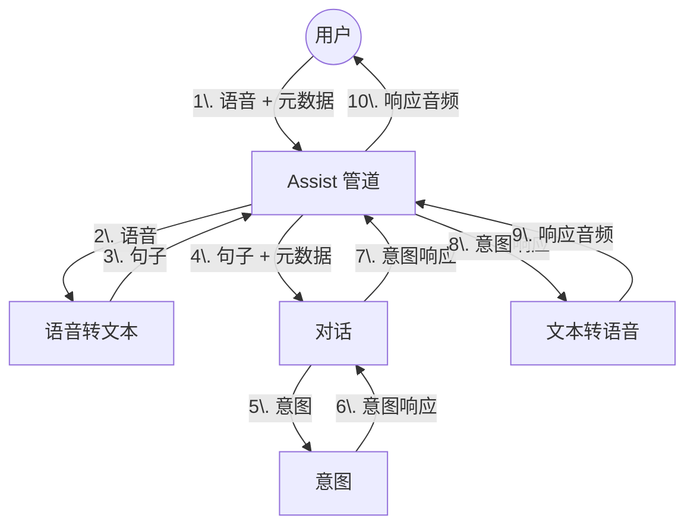

# Home Assistant 语音概览

构建语音助手是一项复杂的任务，需要多种技术协同工作。本页概述了 Home Assistant 语音体系中的主要组成部分，以及它们如何相互配合。

- **Assist 管道**集成负责将用户语音转换为文本、处理文本，并把响应再转换为语音。
- **对话**集成负责处理用户文本。内置对话代理会把文本匹配到某个意图。集成也可以提供[自定义对话代理](/developers/core/entity/conversation)。
- **意图**集成负责执行意图并返回响应。
- **Text-to-Speech** 集成负责将文本转换为语音。集成也可以提供[自定义文本转语音代理](/developers/core/entity/tts)。
- **Speech-to-Text** 集成负责将语音转换为文本。集成也可以提供[自定义语音转文本代理](/developers/core/entity/stt)。

## 捕获用户语音

上图没有说明的一点是：如何捕获用户的语音。这可以通过多种方式实现。

最终目标是打造语音卫星设备（Voice Satellites）。这些设备可以放置在家中的任何位置。一旦检测到唤醒词，它就会捕获用户语音，将其发送给 Home Assistant，并将响应播放给用户。
