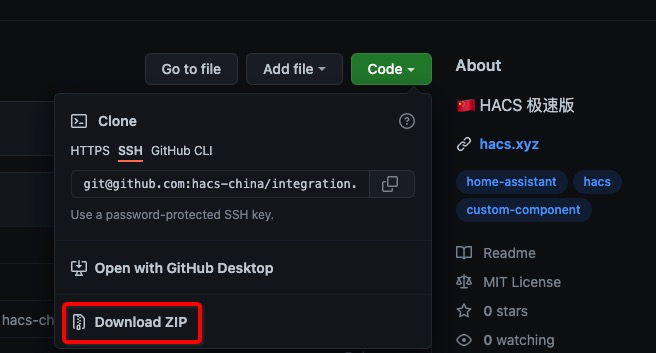

# 🠠HACS 极速版 [](https://github.com/hacs-china/integration/stargazers)
:::info
版本修改作者：[Alone](https://anlo.ng/)
:::

[](https://github.com/hacs-china/integration/releases/latest?include_prereleases)
[](https://github.com/hacs-china/integration/releases)


[HACS](https://hacs.xyz)是一款优秀的 [Home Assistant](https://www.home-assistant.io) 集成商店，然而国人想要使用它下载插件或前端卡片却困难重重，主要原因就是国内的网络环境。
本项目使用了[gitmirror.com](https://gitmirror.com)和[fastgit.org](https://fastgit.org)等提供的Github代理服务，可以让大家更快的下载商店里的插件。

:::tip 我们需要你的帮助
HACS极速版是依赖于有github帐号的玩家共享token来实现免帐号使用的，如果您愿意共享您的token，请[点此](https://tokenhub.hacs.vip/)来帮助有需要的人
:::


<a name="install"></a>
### 安装/更新

:::tip
本项目是HACS官方集成的修改版，安装本项目会覆盖官方的集成，但是无需重新配置集成(共用一套配置)，因此你可以放心安装。如果想切换到官方版本，使用官方的shell命令再安装即可。
:::

:::warning
以下几种方法任选其一！
:::


#### 方法1️⃣: 使用命令安装

```shell
wget -O - https://get.hacs.vip | bash -

# 或

curl -fsSL get.hacs.vip | bash
```

- 如果是haos/hassio/supervised版本的HA，可直接在宿主机或`Terminal & SSH`加载项中执行上面的命令
- 如果是core/docker版本的HA，需要ssh登陆宿主机后，并cd进入到HA配置目录再执行安装命令

#### 方法2️⃣: [`加载项安装器: https://hacs.vip/get-addon`](https://my.home-assistant.io/redirect/supervisor_add_addon_repository/?repository_url=https%3A%2F%2Fgitee.com%2Fhacs-china%2Faddons)

> 需要HAOS或Supervised版本的HA

1. 添加加载项仓库 [`https://gitee.com/hacs-china/addons`](https://my.home-assistant.io/redirect/supervisor_add_addon_repository/?repository_url=https%3A%2F%2Fgitee.com%2Fhacs-china%2Faddons)
2. 找到`HACS极速版安装器`并安装加载项
3. 启动加载项并观察日志
4. 重启HA

#### 方法3️⃣: [`upgrade`](https://my.home-assistant.io/redirect/developer_call_service/?service=hacs.upgrade)服务

> 需要已安装HACS极速版v1.33.0.3版本及以上

1. 在开发者工具中执行服务 [`service: hacs.upgrade`](https://my.home-assistant.io/redirect/developer_call_service/?service=hacs.upgrade)
2. 重启HA使更新后的HACS生效

#### 方法4️⃣: [`shell_command`](https://my.home-assistant.io/redirect/developer_call_service/?service=shell_command.update_hacs_china)服务

1. 复制代码到HA配置文件 `configuration.yaml`
    ```yaml
    shell_command:
      update_hacs_china: |-
        wget -O - https://get.hacs.vip | bash -
    ```
2. 重启HA使配置生效
3. 在开发者工具中执行动作 [`action: shell_command.update_hacs_china`](https://my.home-assistant.io/redirect/developer_call_service/?service=shell_command.update_hacs_china)
4. 再次重启HA使更新后的HACS生效

#### 方法5️⃣: [`Docker安装`](https://hub.docker.com/r/hacn/hacn)

> 仅针对未安装HACS的**Docker**版本的HA

1. 使用命令方式安装
    ```bash
    docker run -d \
      --name homeassistant \
      --privileged \
      --restart=unless-stopped \
      -e TZ=Asia/Shanghai \
      -v /PATH_TO_YOUR_CONFIG:/config \
      -v /run/dbus:/run/dbus:ro \
      --network=host \
      hacn/hacn:stable
    ```
2. 使用Compose安装
    ```yaml
    services:
      homeassistant:
        container_name: homeassistant
        image: hacn/hacn:stable
        volumes:
          - /PATH_TO_YOUR_CONFIG:/config
          - /etc/localtime:/etc/localtime:ro
          - /run/dbus:/run/dbus:ro
        restart: unless-stopped
        privileged: true
        network_mode: host
    ```
3. 启动后[添加HACS集成](https://my.home-assistant.io/redirect/config_flow_start/?domain=hacs)

#### 方法6️⃣: 手动安装

- [点击这里下载](https://github.com/hacs-china/integration/releases/latest/download/hacs.zip)安装包并解压 (如果下载不了请点[这里](https://ghproxy.com/github.com/hacs-china/integration/releases/latest/download/hacs.zip)或[这里](https://hub.fastgit.xyz/hacs-china/integration/releases/latest/download/hacs.zip))
- 通过samba/ftp进入HA配置目录，通常为以下目录：
  - `/usr/share/hassio/homeassistant` haos/hassio宿主机
  - `/config` haos/hassio的`Samba`或`Terminal & SSH`加载项
  - `$HOME/.homeassistant` 以core方式安装的HA默认配置目录
  - docker安装的HA为`-v`参数后面映射的目录
- 在HA配置目录下创建`custom_components`文件夹 (如果已有请忽略)
- 在`custom_components`目录下创建`hacs`文件夹 (如果已有请删除重新创建)
- 將解压出来的文件复制到刚创建的`hacs`文件夹
- 重启HA
- [添加HACS集成](https://my.home-assistant.io/redirect/config_flow_start/?domain=hacs) (仅首次安装)

> ⚠️ 请不要通过下图中的位置下载HACS，会缺少文件
> 


### 常见问题

- [极速版和官方HACS的差别有那些？](https://github.com/hacs-china/integration/compare/main...china)

---

## [其它官方已弃用的安装方式](deprecated)
