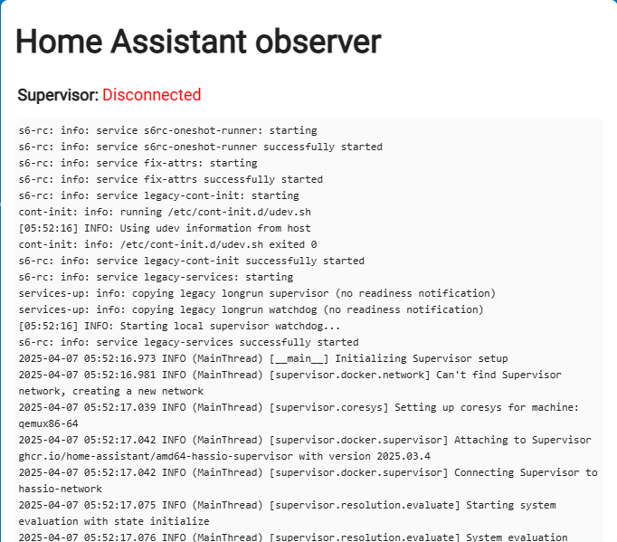
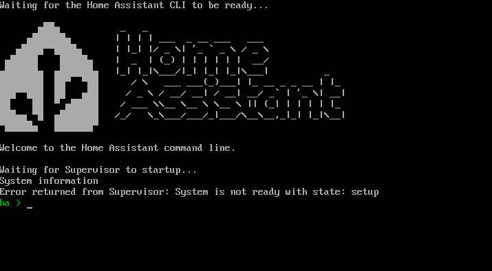
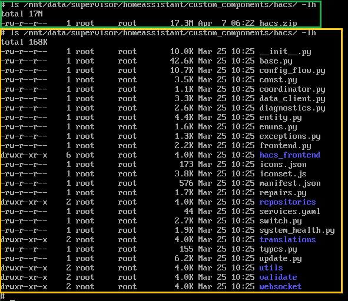
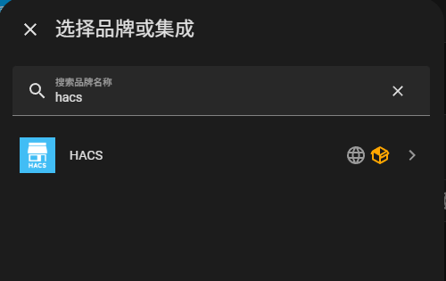
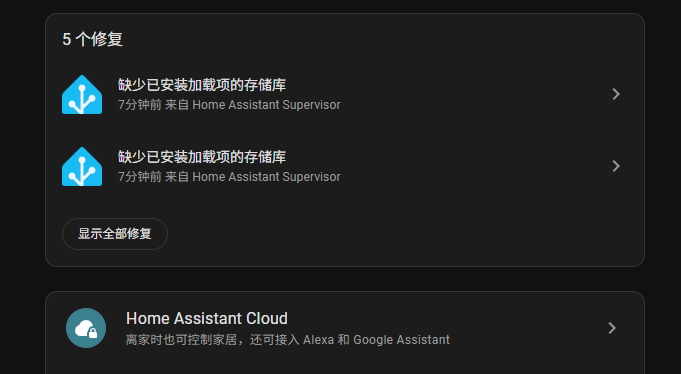

## 如何与官方系统互转

### **Home Assistant 官方系统** 转到 **Home Assistant 极速版** 🌟

📖 **<span style="color:red;">强烈建议先看一遍全文，心里有个大概，再按这步骤一步步操作</span>**

> 🖥️ **重要提示：** 所有操作都是在系统终端，请注意，不是网页上那个 Terminal 

> 💻 **而是连接显示器的那个界面；如果是在虚拟机中，请使用虚拟机控制台的界面.**

> 🔒 **<span style="color:red;">在运行命令之前，请务必做好备份，以防万一，并在备份配置的底部保存好恢复密码。</span>**

[](https://my.home-assistant.io/redirect/backup/) [](https://my.home-assistant.io/redirect/backup_config/)

🔄 请注意，迁移完之后所有的加载项需要重新安装~其它的数据均可以保留 

运行如下命令（命令如果运行成功，将会自动重启，如果失败，则不会对系统造成任何修改）：

```bash
login
curl -fsSL https://ota.hasscn.top/upgrade.sh | bash
```
- 🔄 在系统重启后，请通过浏览器访问以下地址：
  - [http://homeassistant.local:4357](http://homeassistant.local:4357) 
  - [http://HA_IP:4357](http://HA_IP:4357) 
  初始状态可能会显示如下，请耐心等待，系统会自动完成初始化。



- 🖥️ 终端界面可能会显示类似状态，这属于正常现象。



请持续等待，直到所有状态指示灯变为绿色（可能需要刷新浏览器以查看状态更新）。


一旦所有状态均为绿色，您便可以通过以下地址访问系统：
- [http://homeassistant.local:8123](http://homeassistant.local:8123)

> **可选：** 如果您之前未安装过HACS，系统将在此次切换中默认为您安装HACS极速版；如果您已安装，系统将自动跳过此步骤（无论您使用的是原版还是极速版）。

请在终端中**依次**输入以下命令以进行检查：

**提示：** 命令较长时，可以通过按Tab键进行补全，只需在每个斜杠（/）后输入前几个字母即可。

```bash
login
ls /mnt/data/supervisor/homeassistant/custom_components/hacs/ -lh
```

🟢 **绿色框**：如果显示的是 `hacs.zip`，则表示 HACS 尚未成功安装。  
🟡 **黄色框**：如果显示一系列内容，则表示 HACS 已成功安装。  

- 🔍 请确保最终显示的状态为黄色框框。
- ⚠️ 自动安装 HACS 仅会执行一次；如果安装失败，后续需要您手动进行安装。



> 💡 如果您之前安装了普通版 HACS，并希望在无特殊网络环境下充分体验其功能，建议您覆盖安装 HACS 极速版，以确保最佳性能和兼容性。🔄 [点击此处查看安装方式](https://gitee.com/hacs-china/)

✅ 安装完成后，您可以在集成中手动添加 HACS 极速版。



🛠️ 最后，请删除这些 Addons，并在加速源中重新安装即可。
