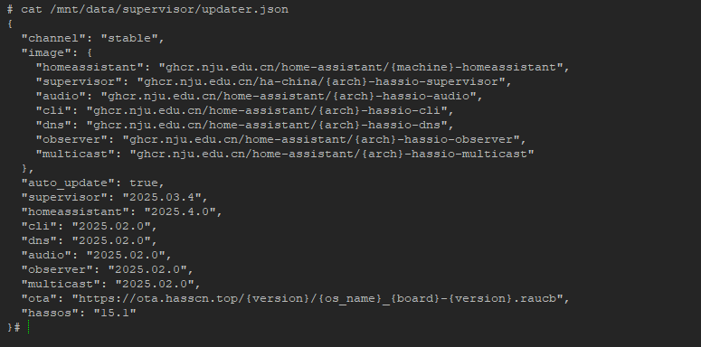
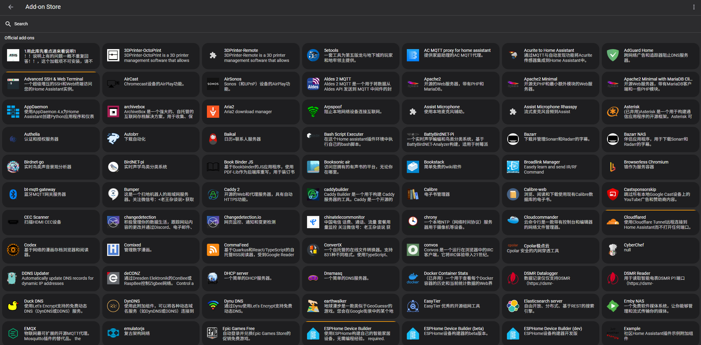

--- 
layout: doc 
---
# 和官方原版互转无忧

## 如何与官方系统互转
> 最推荐的方式还是先备份，然后重新安装，再还原，这样系统最干净。

### **保留配置从官方系统切换至 Home Assistant OS 极速版** 🌟

📖 **强烈建议您在操作前先通读全文，以便对整个过程有一个全面的了解，然后按照步骤逐一进行操作。**

📖 **如果您觉得手册过于繁琐，且家中设备不多，您也可以选择简单直接的[重装](https://ha-doc.hasscn.top/installation/)方式。**

:::warning

🖥️ **重要提示：** 所有操作均需在系统终端中进行，请注意，这不是网页上的 Terminal。

💻 **请使用连接显示器的界面；如果您在虚拟机中，请使用虚拟机控制台的界面。**

🔒 **在执行命令之前，请务必做好备份，以防万一，并在备份配置的底部妥善保存恢复密码。**

:::


| [](https://my.home-assistant.io/redirect/backup/) | [](https://my.home-assistant.io/redirect/backup_config/)| 
|---|---|

:::info

🔄 请注意，迁移完成后，有可能会出现部分加载项需重新安装，而其他数据将保持不变。

:::


请运行以下命令（若命令执行成功，系统将自动重启；若失败，则不会对系统造成任何更改）：

```bash
login
curl -fsSL https://ota.hasscn.top/upgrade.sh | bash
```
- 🔄 系统重启后，请通过浏览器访问以下地址：
  - [http://homeassistant.local:4357](http://homeassistant.local:4357) 
  - [http://HA_IP:4357](http://HA_IP:4357) 
  初始状态可能会显示如下，请耐心等待，系统将自动完成初始化。


- 🖥️ 终端界面可能会显示类似状态，这属于正常现象。


请持续等待，直到所有状态指示变为绿色（可能需要刷新浏览器以查看状态更新）。


一旦所有状态均为绿色，您便可以通过以下地址访问系统：
- [http://homeassistant.local:8123](http://homeassistant.local:8123)

:::tip
**自动：** 如果您之前未安装HACS，系统将在此次切换中默认为您安装HACS极速版；如果您已安装，系统将自动跳过此步骤（无论您使用的是原版还是极速版）。

💡 如果您之前安装了普通版 HACS，并希望在无特殊网络环境下充分体验其功能，建议您覆盖安装 HACS 极速版，以确保最佳性能和兼容性。🔄 [点击此处查看安装方式](https://gitee.com/hacs-china/)
:::

✅ 安装完成后，您可以在集成中直接手动添加 HACS 极速版。


:::note

此问题在最新版的upgrade.sh里已经得到了极大的优化，可能不会出现这个问题，或者只有少量的加载项会有这个问题

视你加载项的安装情况而定

🛠️ 最后，请删除这些加载项，并在加速源中重新安装即可。


:::


---

### 常见问题


:::tip 如何验证切换是否成功？

如果系统启动界面看到了下面这句话

:::

```
This is an open source version, commercial use without permission is prohibited
```

- 并且看到的官方商店变成了这样全中文的
> 点击下面这个按钮，进入到你的加载项商店
[](https://my.home-assistant.io/redirect/supervisor_store/)



:::tip 发现我还在原系统怎么办？

首先不要怕，系统肯定刷进去了，因为Home Assistant是A/B 轮流启动的，所以很有可能正好你把系统刷在了B区，结果启动是A区
第一行与第二行都试一下

:::


如果这个界面一闪而过你没有机会选择，在系统启动成功后可以通过命令切换A分区还是B
```bash
ha os boot-slot A #如果你上一次启动的是slot B那这命令行保持不换，如果上一次启动的是slot A则把命令里的A换成B
```
然后再重启系统
``` bash
ha host reboot
```