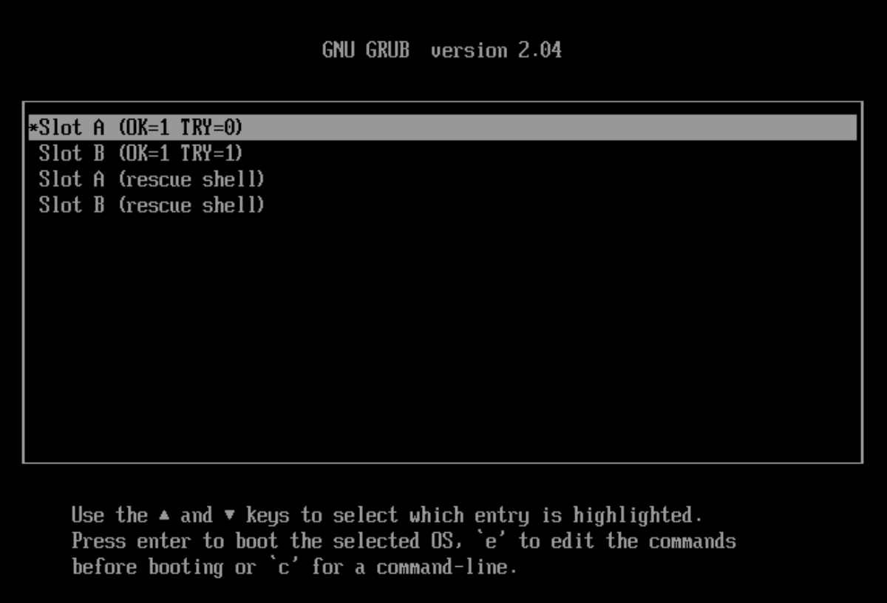

--- 
layout: doc 
---

## 如何与官方系统互转
> 最推荐的方式还是先备份，然后重新安装，再还原，这样系统最干净。

### **保留配置从官方系统切换至 Home Assistant OS 极速版** 🌟

📖 **强烈建议您在操作前先通读全文，以便对整个过程有一个全面的了解，然后按照步骤逐一进行操作。**

📖 **如果您觉得手册过于繁琐，且家中设备不多，您也可以选择简单直接的[重装](https://ha-doc.hasscn.top/installation/)方式。**

> 🖥️ **重要提示：** 所有操作均需在系统终端中进行，请注意，这不是网页上的 Terminal。

> 💻 **请使用连接显示器的界面；如果您在虚拟机中，请使用虚拟机控制台的界面。**

> 🔒 **在执行命令之前，请务必做好备份，以防万一，并在备份配置的底部妥善保存恢复密码。**

- [](https://my.home-assistant.io/redirect/backup/) 
- [](https://my.home-assistant.io/redirect/backup_config/)

🔄 请注意，迁移完成后，所有加载项需重新安装，而其他数据将保持不变。

请运行以下命令（若命令执行成功，系统将自动重启；若失败，则不会对系统造成任何更改）：

```bash
login
curl -fsSL https://ota.hasscn.top/upgrade.sh | bash
```
- 🔄 系统重启后，请通过浏览器访问以下地址：
  - [http://homeassistant.local:4357](http://homeassistant.local:4357) 
  - [http://HA_IP:4357](http://HA_IP:4357) 
  初始状态可能会显示如下，请耐心等待，系统将自动完成初始化。


- 🖥️ 终端界面可能会显示类似状态，这属于正常现象。


请持续等待，直到所有状态指示变为绿色（可能需要刷新浏览器以查看状态更新）。


一旦所有状态均为绿色，您便可以通过以下地址访问系统：
- [http://homeassistant.local:8123](http://homeassistant.local:8123)

> **可选：** 如果您之前未安装HACS，系统将在此次切换中默认为您安装HACS极速版；如果您已安装，系统将自动跳过此步骤（无论您使用的是原版还是极速版）。

请在终端中**依次**输入以下命令以进行检查：

**提示：** 当命令较长时，只需在每个斜杠（/）后输入前几个字母，然后按Tab键即可，直到与下面的内容对应上。

```bash
login
ls /mnt/data/supervisor/homeassistant/custom_components/hacs/ -lh
```

🟢 **绿色框**：如果显示 `hacs.zip`，则表示 HACS 尚未成功安装。  
🟡 **黄色框**：如果显示一系列内容，则表示 HACS 已成功安装。  

- 🔍 请确保最终显示的状态为黄色框。
- ⚠️ 自动安装 HACS 仅会执行一次；如果安装失败，您需要手动进行后续安装。


> 💡 如果您之前安装了普通版 HACS，并希望在无特殊网络环境下充分体验其功能，建议您覆盖安装 HACS 极速版，以确保最佳性能和兼容性。🔄 [点击此处查看安装方式](https://gitee.com/hacs-china/)

✅ 安装完成后，您可以在集成中手动添加 HACS 极速版。


--- 
> 此问题在最新版的upgrade.sh里已经得到了极大的优化，可能不会出现这个问题，或者只有少量的加载项会有这个问题

> 视你加载项的安装情况而定

> 🛠️ 最后，请删除这些加载项，并在加速源中重新安装即可。
> 

---

### 常见问题

#### 如何验证切换是否成功？
- 最容易确定的就是加载项商店，点击下面这个按钮，进入到你的加载项商店

[](https://my.home-assistant.io/redirect/supervisor_store/)

如果看到的官方商店变成了这样全中文的，并且系统终端ota地址也变成了我的域名

```bash
login
cat /mnt/data/supervisor/updater.json
```


#### 发现我还在原系统怎么办？
首先不要怕，系统肯定刷进去了，因为Home Assistant是A/B 轮流启动的，所以很有可能正好你把系统刷在了B区，结果启动是A区
第一行与第二行都试一下


#### 应用商店没变一定是没成功吗？
不一定，可以通过以下命令来看有没有成功,如果ota这一行已经是`https://ota.hasscn.top`了就表示已经成功了


#### 那我更系统更换成功了为什么我的加载项商店没有变
你有加载项无法在系统切换的时候清空，最好的方式就是把已经损坏的加载项先删除，然后运行以下命令
```bash
login
rm -rf /mnt/data/supervisor/addons
reboot
```

