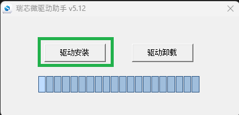
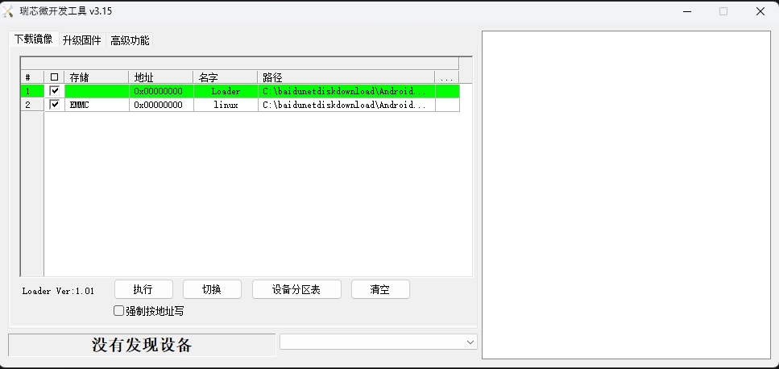
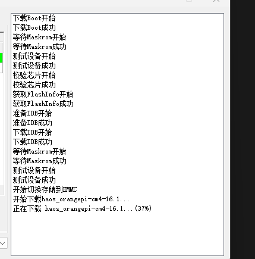

# 香橙派刷机步骤
香橙派的卡刷其实与树莓派一致，因此将不再赘述，可以直接参考[树莓派的刷机方式](./raspberrypi.md)，下面将引导你一步步将固件刷入EMMC
### 所需软件
首先我们会需要一根USB公对公的线
然后我们需要下载对应的[驱动与烧录工具](https://pan.baidu.com/s/1KM8Ka1H-qf9LJ1gUUw_FQA?pwd=9nje#list/path=%2Fsharelink1077680202-481671595650009%2F%E5%AE%98%E6%96%B9%E5%B7%A5%E5%85%B7%2FAndroid%E5%92%8CLinux%E9%95%9C%E5%83%8F%E7%83%A7%E5%BD%95%E5%B7%A5%E5%85%B7-RKDevTool%E5%92%8C%E9%A9%B1%E5%8A%A8%E7%A8%8B%E5%BA%8F&parentPath=%2Fsharelink1077680202-481671595650009)

### 安装驱动
安装驱动比较简单，打开之后直接点驱动安装即可

### 刷机前准备
- 拔掉电源线
- 按要求插好USB线
- 打开刷机软件
- 按住刷机按钮然后通电
- 确保下面*不是*没有发现设备，而是有设备列表的

这个软件界面并不是这么好友，点三个点下面的空白处选择对应的文件
- 第一行，Loader里选择下载包里面的`MiniLoaderAll.bin`文件
- 第二行EMMC选择**解压**后的`Home Assistant OS 极速版`固件 (扩展名为.img)
- 勾选`强制按地址写`
- 最后点击`执行`

当右边空白框出现如下界面则表示开始刷写了，等到他100%即可

