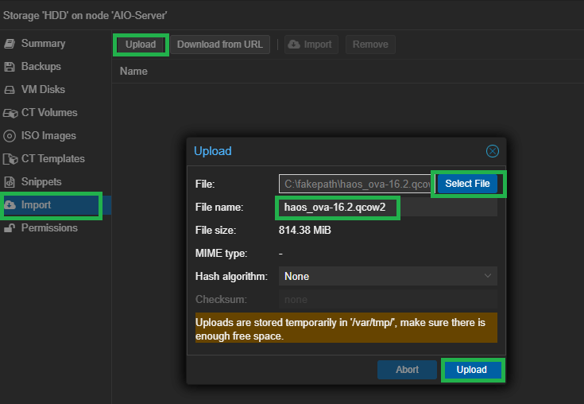
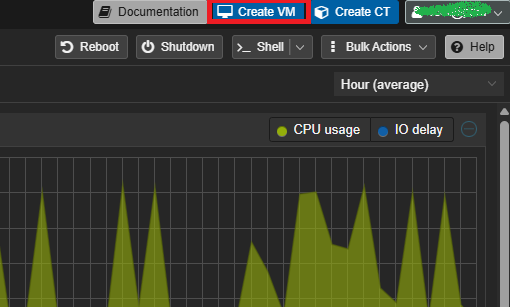
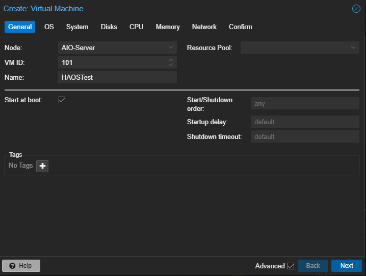
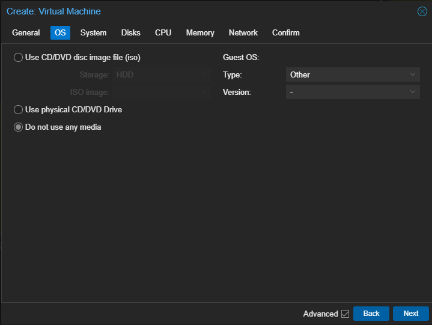
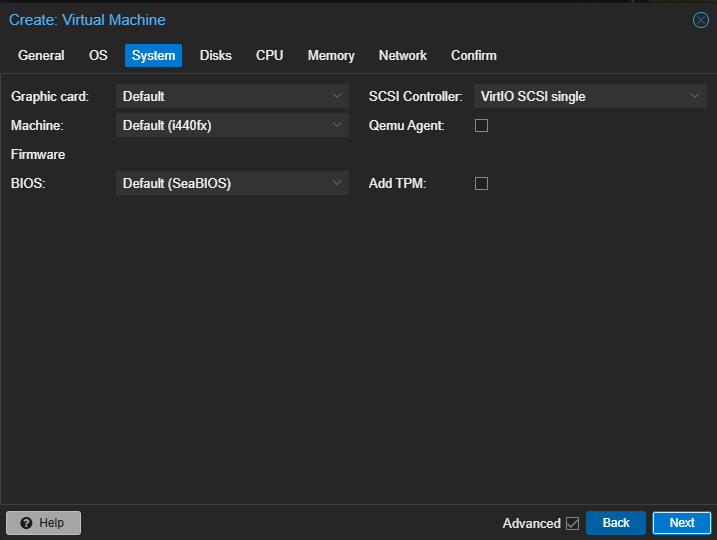
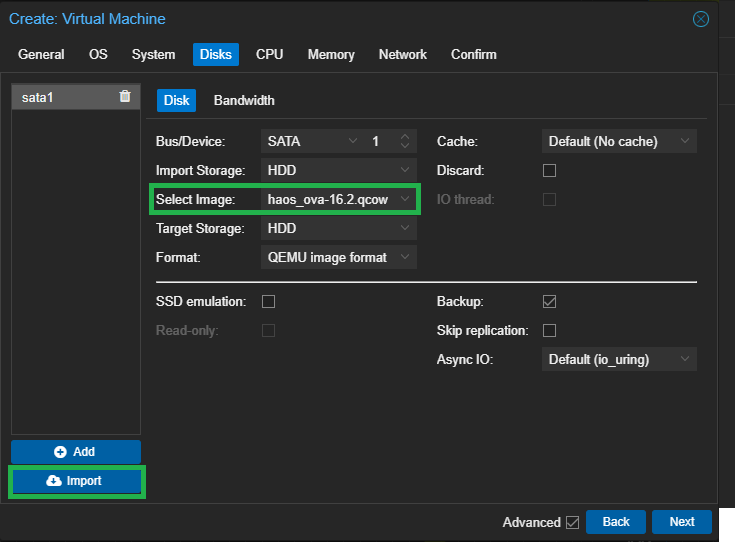
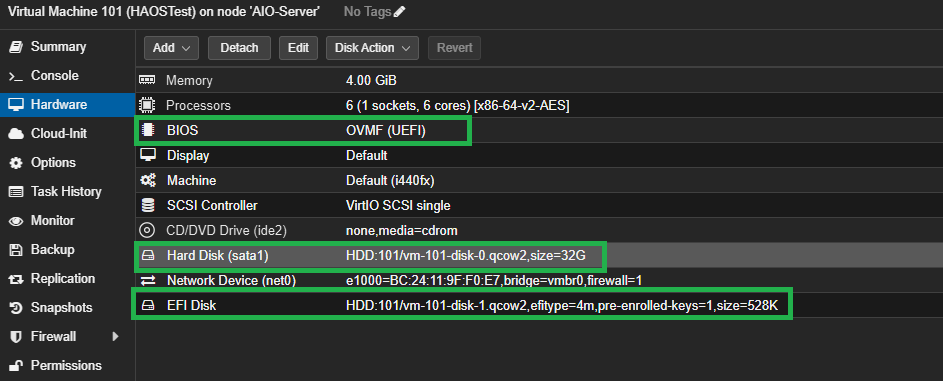

# Proxmox VE 刷机步骤

1. 下载对应的固件，并且解压缩成.qcow2格式

2. 上传.qcow2文件到 Proxmox VE 控制台的本地存储中

2. 登录 Proxmox VE 控制台，在右上角点击新建虚拟机

3. 关键步骤：选择本地存储，选择刚刚上传的.qcow2文件，点击创建

4. 其余的步骤都根据你的需求来选择，然后点击创建

5. 创建完成后，点击虚拟机，继续进行最后一步的编辑

6. 在编辑页面，确保关键点跟我上图中的类似即可。
