# 树莓派刷机步骤
### 所需软件

- SD Card 烧录工具：[Balena Etcher](https://etcher.balena.io/) 或 [Raspberry Pi Imager](https://www.raspberrypi.com/software/) 等 
- 从本站下载最新的对应的树莓派镜像文件.

### 操作步骤

推荐使用 [Balena Etcher](https://etcher.balena.io/) 或 [Raspberry Pi Imager](https://www.raspberrypi.com/software/) 烧录镜像，二者选其一即可

#### Balena Etcher

- 将 SD Card 接入读卡器中，并插在电脑上(Windows/MacOS/Linux)
- 运行 Balena Etcher

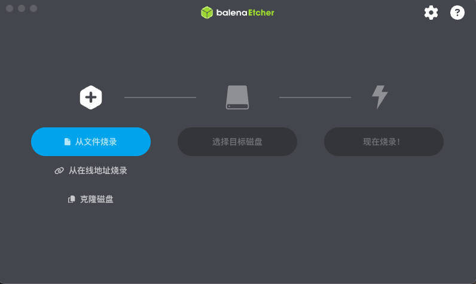

- "从文件烧录" -> 选择下载到本地的`Home Assistant OS 极速版`镜像文件

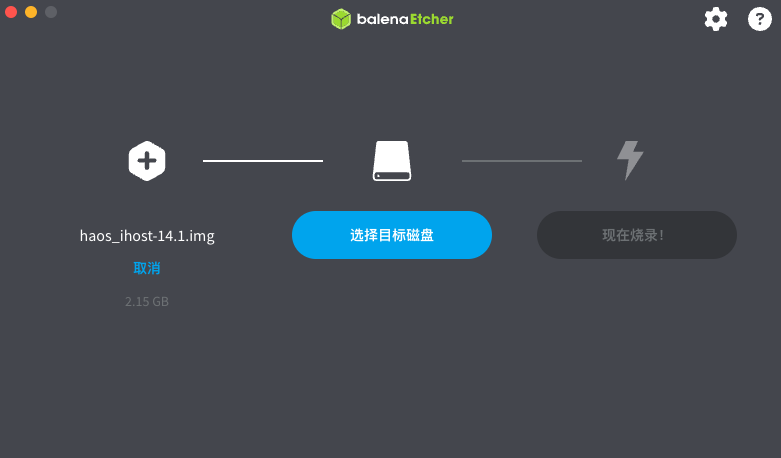

- "选择目标磁盘" -> 选择您所插入的 SD Card [!!!请注意不要选错磁盘!!!]

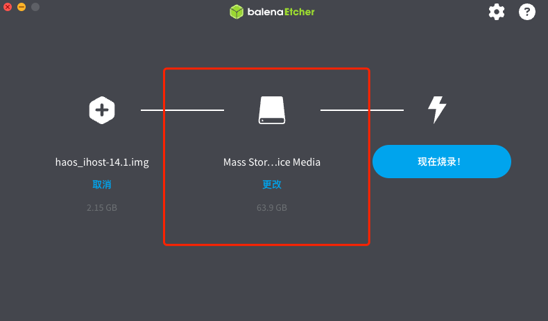

- 点击"现在烧录！"开始将下载的`Home Assistant OS 极速版`镜像文件烧录到 SD Card中，烧录过程中请不要操作 SD Card

#### Raspberry Pi Imager

- 将 SD Card 接入读卡器中，并插在电脑上(Windows/MacOS/Linux)
- 运行  Raspberry Pi Imager

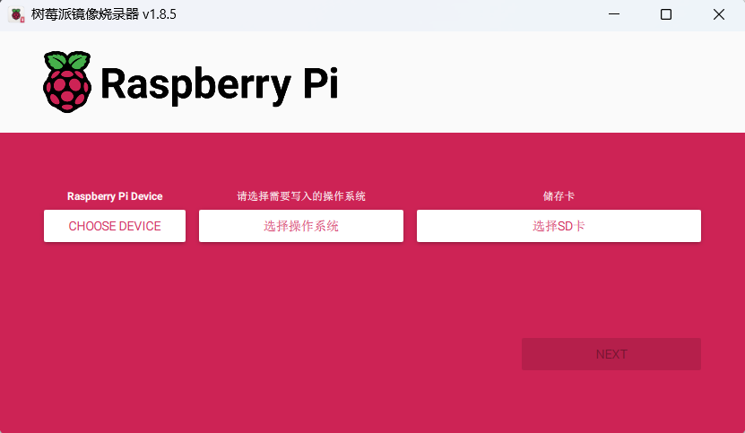

- "选择设备" -> 选择 No filtering

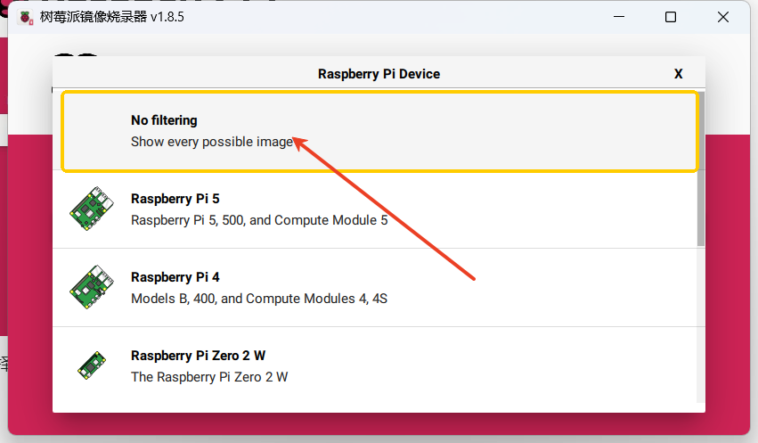

- "选择操作系统" -> 选择 Use custom> 选择下载到本地的`Home Assistant OS 极速版`镜像文件

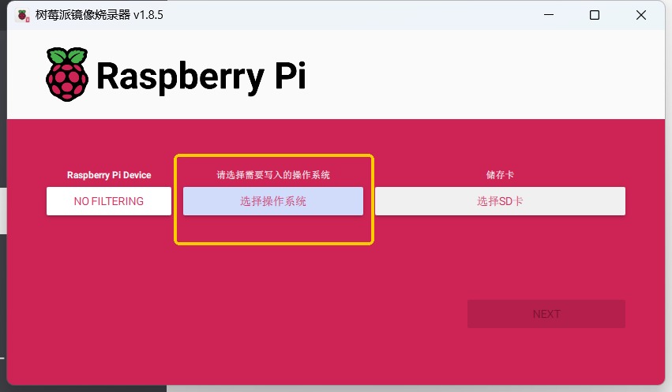

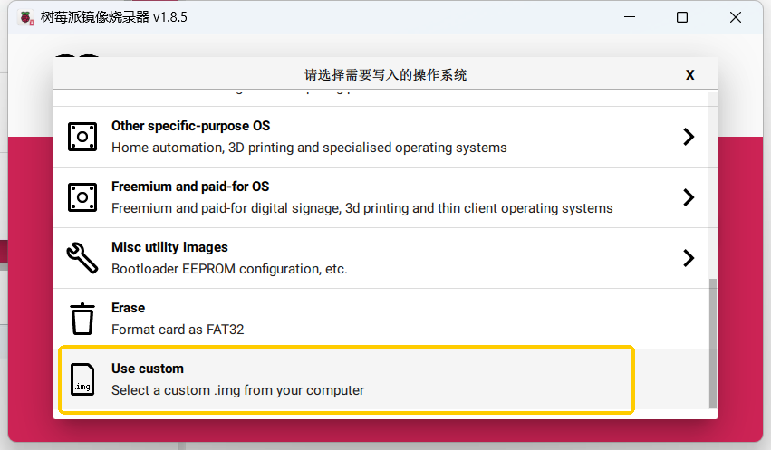

- "选择SD卡" -> 选择您所插入的 SD Card [!!!请注意不要选错磁盘!!!]

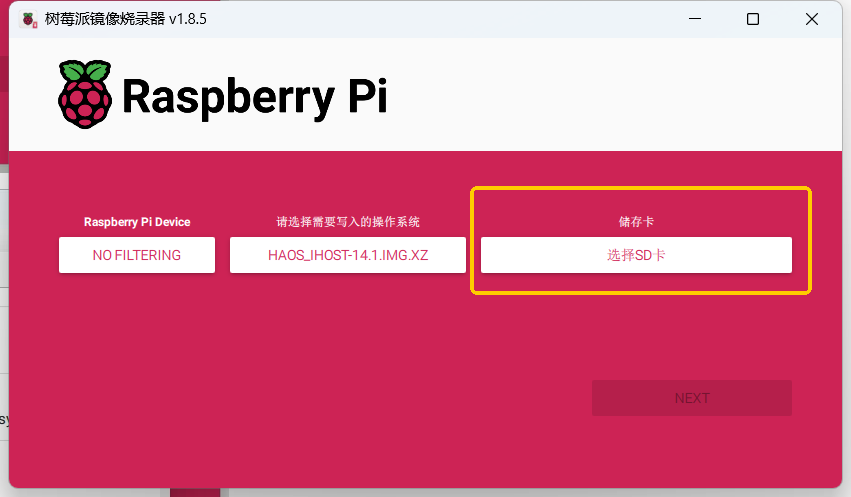

- 点击"NEXT"-> 允许清空SD卡的所有数据 

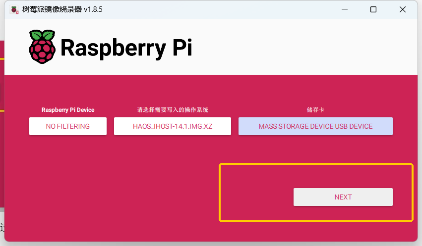

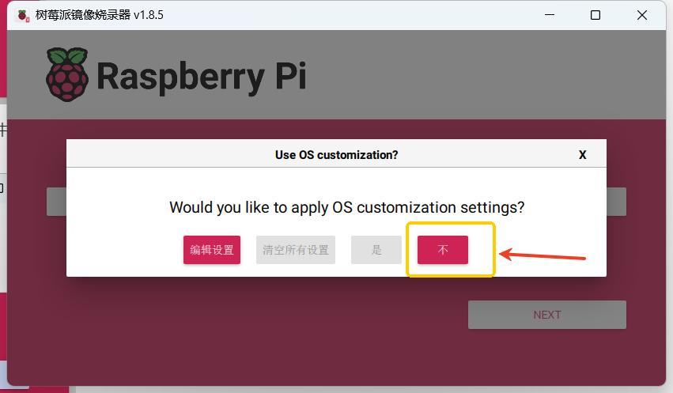

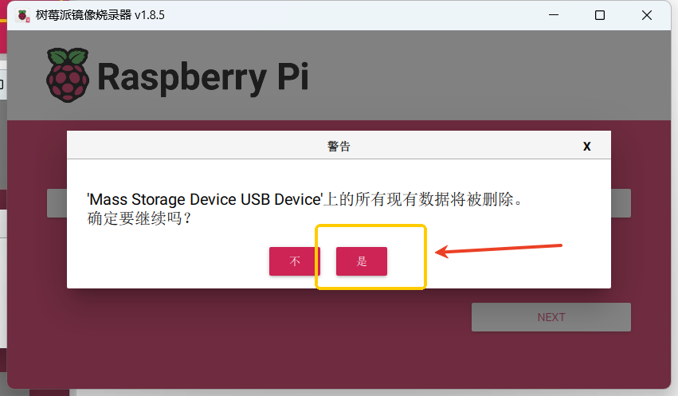

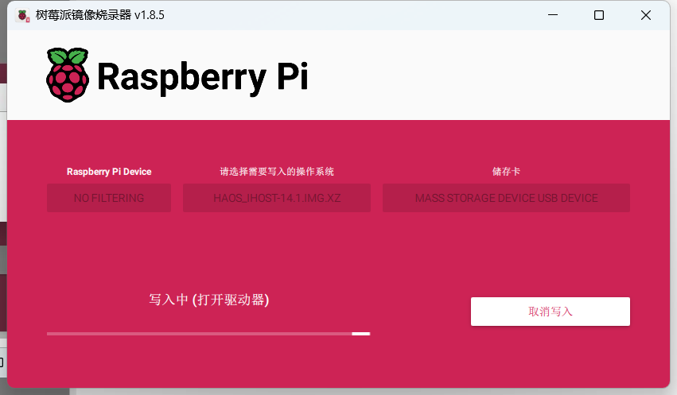

- 开始将下载的`Home Assistant OS 极速版`镜像文件烧录到 SD Card中，烧录过程中请不要操作 SD Card