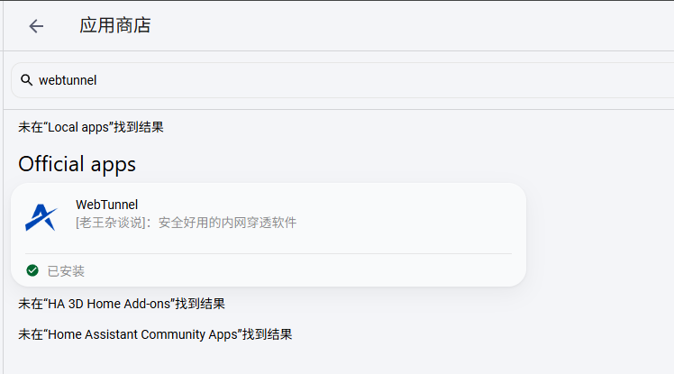
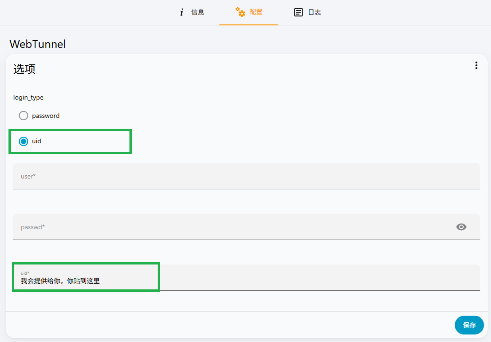
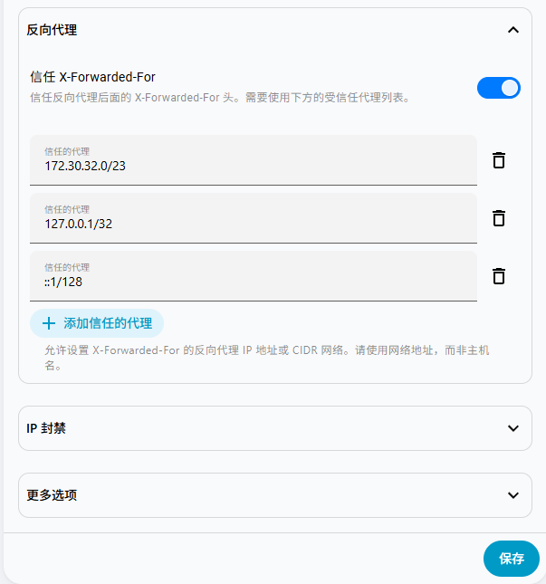

# 穿透服务

:::info 背景与缘起

由于网络的管控与合规要求，Home Assistant Cloud（Nabu Casa）在大陆地区的连接稳定性、访问速度均难以令人满意，甚至在部分环境下完全无法访问，直接影响了国内用户的使用体验。

市面上的免费方案虽多，但免不了要折腾配置；收费方案则都是订阅制，一年的费用差不多也要 100~300 元。

为了化解这一困境，本站特别联合 [WebTunnel](https://www.pgrm.top/) —— 国内专业的远程访问与物联网接入服务商，以**半贡献保成本**的运营方式，为各位奉上 **专属永久套餐**。无需频繁续费，随时随地，安全稳定地控制家里的设备。

:::

## 永久套餐

采用**半贡献保成本**的运营模式，**一次性付费 288 元**，永久使用：

- ✅ **永久有效**：为打消"永久"的顾虑，我们郑重承诺：**至少提供 4 年稳定服务**——4年后只要 WebTunnel 还在运营，稳定的服务则会一直提供；
- ✅ **开箱即用**：专为 Home Assistant 优化部署，安装即可体验；
- ✅ **半贡献保本**：贡献为主，保本为辅，不以盈利为目标，以半贡献保本的方式解决你的远程需求。
- ✅ **丝滑迁移**：重装、换机器不失效，只需填入 uid 即可无缝迁移。
- ✅ **合规安全**：数据不出境，境外无法访问，符合国内合规要求。

如有需要，请联系客服微信：[点击咨询](https://work.weixin.qq.com/kfid/kfcdcf37def1208bbb9)


:::warning 使用限制

因本服务为半贡献的方式提供，此服务仅限用于 Home Assistant 当中，不得用于其他任何用途。一旦发现违规使用，将**直接禁用服务**。

每份套餐仅限穿透一台 Home Assistant 主机，如有多个 HA 则需要购买多份。

:::

:::note 免责声明

本服务仅供合法合规的远程访问使用，请自觉遵守相关法律法规及所在单位的网络管理规定，严禁用于跨境访问或任何违法违规用途。

:::

## 安装方式

:::tip 注意
如果之前已有账号登录，请先退出，否则 uid 会被旧账户覆盖。
:::

### HAOS 极速版

一键直达，无需手动添加仓库：

[](https://my.home-assistant.io/redirect/supervisor_addon/?addon=core_webtunnel)

### HAOS 官方版

先添加仓库，再搜索安装：

[](https://my.home-assistant.io/redirect/supervisor_add_addon_repository/?repository_url=https://gitee.com/desmond_GT/hassio-addons)

然后在[](https://my.home-assistant.io/redirect/supervisor_store/)搜索 WebTunnel 安装：



安装完成后，在配置中选择并填入 uid，保存后启动即可：



### Docker 版

需要单独运行一个 WebTunnel 容器。

不同平台下的部署方式请参阅 [WebTunnel 官方手册](https://d.pgrm.top/client/docker.html)，以下为参考命令：

``` bash title="docker run"
docker run -d --net host \
  -v /etc/hostname:/etc/hostname:ro \
  -v /etc/localtime:/etc/localtime:ro \
  -v /etc/resolv.conf:/etc/resolv.conf:ro \
  -v ~/:/root/.webtunnel \
  --restart=always r.pgrm.top/webtunnel:latest
```

在 `-v ~/:/root/.webtunnel` 映射的目录中添加 `config.json`：

``` json title="config.json"
{"uid":"这里填我给你的uid","time":1785734538734}
```

如果该文件已存在，说明之前登录过，请先退出账号，停止容器，修改 uid，再重新启动容器。

同时请将你的 Home Assistant 局域网访问地址告知我（建通道时需要填写），例如：`http://192.168.0.110:8123`

## 常见错误

### 外网访问 400 错误

2026.08.0 之前的版本需要在 `configuration.yaml` 里添加以下配置并重启：

``` yaml title="configuration.yaml"
http:
  use_x_forwarded_for: true
  trusted_proxies:
    - 172.30.32.0/23
    - 127.0.0.1
    - ::1
    # docker 版本额外添加一个你家里局域网的网段
    # 如： - 192.168.0.0/24
```

2026.08.0 版本及以上需要在网络配置中添加如下内容：

